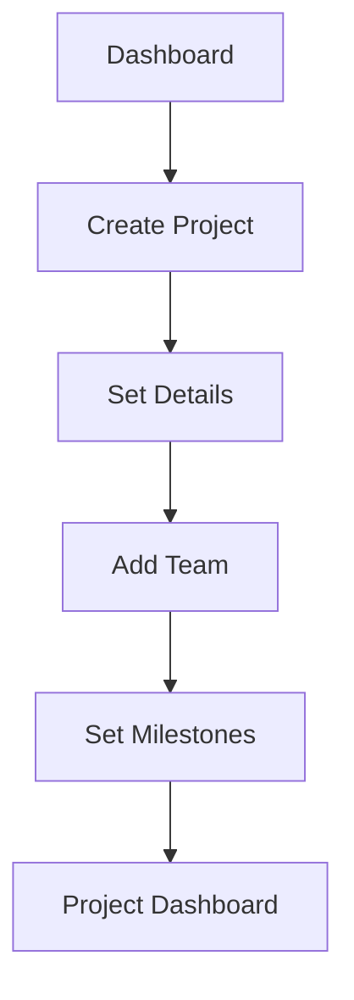
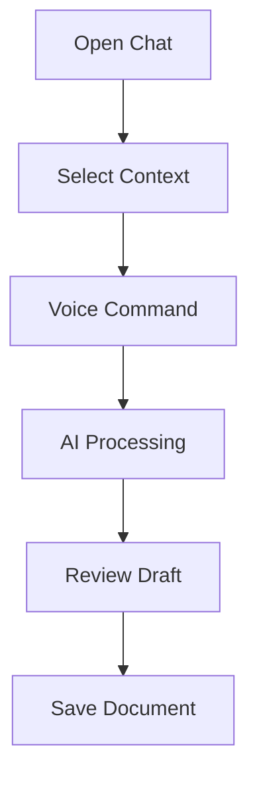
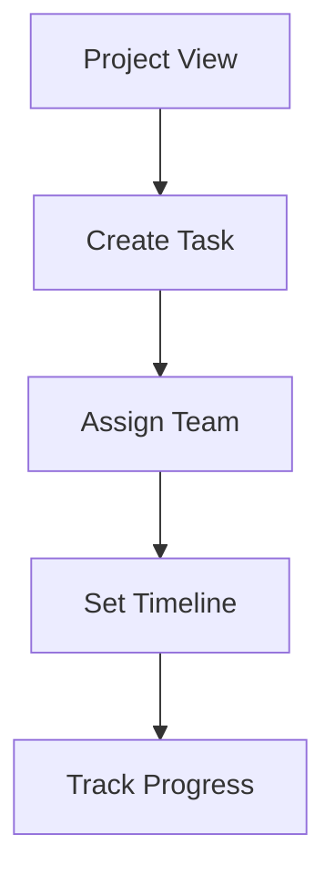

# Product Requirements Document (PRD)

## Product Overview

Constructiv AI's Max is the ultimate productivity platform for construction professionals, delivering a 40% reduction in administrative workload and saving 16-20 hours weekly through voice-first automation. By combining natural communication, AI insights, and seamless integrations, Max transforms the way small and medium construction businesses operate—empowering builders to "Build More, Type Less."

### Purpose

Constructiv AI aims to streamline construction processes through voice-first, AI-powered tools, focusing on improving efficiency and workflow management for small to midsize construction businesses.

In the construction industry, small and medium-sized businesses are overwhelmed by administrative tasks. Builders spend 40% of their workweek on paperwork and juggling disconnected systems, leading to inefficiencies, delays, and wasted resources.

### Target Users

- Construction Company Owners
- Site Supervisors
- Construction Project Managers
- Field Workers
- Administrative Staff

## Construction Management Software

- Software  should be an enabler. It should NOT hinder you. It should NOT restrict you.
- Software should do things that **only it can do**, to **enable you to do things that only you can and should be doing.**

### **Qualities Of A Good Construction Management Software**

- construction management software is only useful if it is fast, addictive, and useful to the application.
- If it if it creates complexity, it's not worth the users time. If it adds a number of different steps, it is wasting the users time.
- It should make normal and necessary workflows faster.
- It should **streamline** and **automate** natural processes like, for example, RFIs, submittals, daily reports, documentation, scheduling and pay applications.
- The software needs to adapt to the users workflow—they need to be able to configure the application to work their way.
- The software must increase efficiency.
- The software should enhance communication, focus, and teamwork.

## User Personas & Journey Maps

### Primary Persona: Drew Gammon (Builder/Owner)

- **Profile**:
  - Age: 36
  - Role: Owner/Builder at Gammon Construction
  - Company Size: 7 employees
  - Annual Projects: ~25 homes
  - Tech Attitude: Open to early adoption, values mobile solutions
  
- **Key Pain Points**:
  - System integration issues causing manual data entry
  - Administrative burdens (~50 weekly invoices)
  - Complex pre-construction workflow management
  - Limited office support staff
  
- **Daily Journey**:
  1. Early Morning (5:30 AM - 7:30 AM)
     - Reviews emails and messages
     - Plans daily site visits
     - Coordinates with subcontractors
  2. Project Management (7:30 AM - 12:00 PM)
     - Site visits and inspections
     - Quality control checks
     - Client communications
  3. Administrative Tasks (1:00 PM - 4:00 PM)
     - Progress reports
     - Financial tracking
     - Compliance management
  4. Family Time & Planning (4:00 PM - 8:00 PM)
     - Emergency issue handling
     - Next day planning
     - Final client communications

#### Secondary Persona: Michael Rodriguez (Traditional Builder)

- **Profile**:
  - Age: 45
  - Role: Construction Business Owner
  - Company Size: 5 employees
  - Annual Projects: 15-20 homes
  - Tech Attitude: Cautious adopter, prefers desktop solutions
  
- **Key Pain Points**:
  - Resistance to new technology
  - Paper-based documentation
  - Communication gaps with team
  - Evening administrative workload

#### User Interaction Flows

- **Project Creation & Setup**



- **Document Generation with Max**



- **Task Management**



#### Key User Requirements

1. **Efficiency & Time Savings**
   - Quick voice-based task creation
   - Automated document generation
   - Streamlined project setup
   - Mobile-first design

2. **Ease of Use**
   - Intuitive interface
   - Minimal training required
   - Clear navigation
   - Consistent design

3. **Integration & Access**
   - Works with existing tools
   - Available on all devices
   - Offline capability
   - Real-time updates

### Success Metrics & KPIs

#### Overall Platform Metrics

- Administrative Reduction: 40% reduction in administrative workload
- Time Savings: 16-20 hours saved weekly
- Voice Command Success: 95% accuracy in natural communication
- User Adoption: 80% daily active users
- System Uptime: 99.9% availability
- Mobile Usage: 60% of interactions via mobile devices
- Customer Satisfaction: Net Promoter Score (NPS) > 50

#### 1. Project Management

- Project Setup Time: 40% reduction through voice commands
- Team Adoption: 80% of team members actively using the platform within first month
- Project Visibility: 100% of project milestones tracked and visible
- Resource Efficiency: 40% improvement in resource allocation accuracy
- Data Accuracy: 95% reduction in data entry errors

#### 2. Task Management

- Task Creation Speed: 40% faster through voice-first approach
- Natural Communication: 95% accuracy in voice command interpretation
- Task Completion Rate: 25% improvement in on-time task completion
- Team Coordination: 50% reduction in task-related communication overhead
- Status Updates: 90% of tasks updated within 24 hours

#### 3. Document Management

- Document Generation: 40% reduction in document creation time
- Voice Command Success: 95% accuracy in natural communication
- Template Utilization: 60% of documents generated using AI templates
- Search Efficiency: 90% of documents findable within 30 seconds
- Version Control: 100% of document versions tracked and accessible

#### 4. AI Assistant (Max)

- Voice Recognition: 95% accuracy in understanding natural communication
- Response Time: < 2 seconds for AI responses
- Command Success: 90% of voice commands executed correctly
- Context Awareness: 85% accuracy in project context understanding
- User Satisfaction: 80% of users rating Max as "Very Helpful"

#### 5. Authentication & User Management

- User Onboarding: < 5 minutes to complete initial setup
- Security Incidents: Zero unauthorized access attempts
- Role Management: 100% of user roles correctly configured
- Session Management: < 1% of users experiencing authentication issues
- Access Control: Zero permission-related data breaches

## Features and Functionality

### Core Features (MVP)

#### Epic 1: Project Management

1. **Feature Name**
   - **Project Management**

2. **Purpose & Value**
   - Provides builders with a centralized way to organize and monitor projects, ensuring efficiency and reducing confusion across milestones, resources, and timelines.
   - Solves the problem of fragmented project details and helps users track progress effectively, enhancing overall project visibility.

3. **User Story**

> As a builder, I want to create, set up, and monitor my projects, so that I can ensure they progress on schedule with clear milestones and resource allocation.

##### Implementation Details

###### Technical Stack

```typescript
// Project model
model Project {
  id          String      @id @default(cuid())
  name        String
  address     String
  startDate   DateTime
  endDate     DateTime
  status      String
  neighborhood String?    // Optional neighborhood name
  lotNumber   String?    // Optional lot number
  housePlanName String?  // Optional house plan name
  milestones  Milestone[]
  team        TeamMember[]
  createdAt   DateTime    @default(now())
  updatedAt   DateTime    @updatedAt
}
```

###### API Endpoints

```typescript
// Project endpoints
POST /api/projects           // Create project
GET /api/projects           // List projects
GET /api/projects/{id}      // Get project details
PUT /api/projects/{id}      // Update project
DELETE /api/projects/{id}   // Delete project
```

###### Key Actions & User Flow

1. **Create a new project** with essential details (name, address, start/end dates)
2. **Set project milestones** and assign due dates
3. **Add team members** and define roles (owner, manager, member)
4. **View project progress** through visual indicators and timelines
5. **Update milestone statuses** as tasks are completed
6. **Filter and group projects** by neighborhood, house plan name, or milestone status
7. **Track historical data** for neighborhoods and house plans

###### Acceptance Criteria

- **Sub-feature 1.1: Project Creation and Setup**
  - Users can create a project with validated fields:
    - Name (required)
    - Address (required)
    - Start date (required)
    - End date (required, must be after start date)
    - Category (residential, commercial, industrial, other)
    - Status (planning, in_progress, on_hold, completed)
    - Neighborhood (optional, with historical tracking)
    - Lot number (optional, format validation: "Lot X" or numeric)
    - House plan name (optional, with historical tracking)
  - System maintains last used timestamps for neighborhoods and house plans
  - Users can select from previously used values in dropdowns
  - Users can define project milestones with due dates
  - Users can assign team members with specific roles (owner, manager, member)
  - The system validates required fields before allowing project creation
  - Users can upload and attach project-related documents

- **Sub-feature 1.2: Project Tracking**
  - Users can view visual progress indicators for each milestone
  - Users can update milestone statuses (pending, in_progress, completed)
  - Changes to milestones update the project progress percentage automatically
  - Users can view a project timeline visualization with start and end dates
  - Milestones display alerts for overdue tasks
  - System maintains audit logs for all status changes

- **Sub-feature 1.3: Resource Management**
  - Users can assign team members to specific projects with roles
  - Users can view a list of assigned team members and their roles
  - System enforces role-based permissions for project actions
  - Notifications are sent to team members when roles change
  - The system highlights resource conflicts

- **Sub-feature 1.4: Project Filtering and Organization**
  - Users can filter projects by milestone status (Not Started, In Progress, Completed)
  - Users can filter projects by neighborhood from a dropdown of existing neighborhoods
  - Users can filter projects by house plan name from a dropdown of existing plans
  - Users can combine filters in any combination:
    - Milestone status + Neighborhood
    - Milestone status + House Plan
    - All three filters together
  - Filter selections persist across sessions
  - Users can see the count of projects for each filter combination
  - Users can clear individual or all filters with a single action
  - Filtered views maintain all other project list functionality

###### Technical Notes / Implementation Details

- **Frontend Stack**:
  - Next.js 14 with App Router for routing and server components
  - React 18 for UI components
  - TypeScript for type safety
  - Tailwind CSS & shadcn/ui for UI components and styling
  - Zustand for project state management
  - React Query for server state and caching
  - React Hook Form + Zod for form validation

- **Backend & Data Layer**:
  - Next.js API routes for backend endpoints
  - Prisma ORM for database operations
  - Supabase for:
    - PostgreSQL database (projects, milestones, resources)
    - Authentication
    - File storage for project documents

- **Data Models**:

```typescript
// Project model
model Project {
  id          String      @id @default(cuid())
  name        String
  address     String
  startDate   DateTime
  endDate     DateTime
  status      String
  neighborhood String?    // Optional neighborhood name
  lotNumber   String?    // Optional lot number
  housePlanName String?  // Optional house plan name
  milestones  Milestone[]
  team        TeamMember[]
  createdAt   DateTime    @default(now())
  updatedAt   DateTime    @updatedAt
}

// Milestone model
model Milestone {
  id          String    @id @default(cuid())
  name        String
  dueDate     DateTime
  status      String
  projectId   String
  project     Project   @relation(fields: [projectId], references: [id])
}

// TeamMember model
model TeamMember {
  id          String    @id @default(cuid())
  userId      String
  projectId   String
  role        String
  project     Project   @relation(fields: [projectId], references: [id])
}
```

- **API Routes**:

```typescript
// Project endpoints
POST /api/projects           // Create project
GET /api/projects           // List projects
GET /api/projects/{id}      // Get project details
PUT /api/projects/{id}      // Update project
DELETE /api/projects/{id}   // Delete project

// Milestone endpoints
POST /api/projects/{id}/milestones
PUT /api/projects/{id}/milestones/{milestoneId}
DELETE /api/projects/{id}/milestones/{milestoneId}

// Team management endpoints
POST /api/projects/{id}/team
DELETE /api/projects/{id}/team/{memberId}

// Add new filter endpoints
GET /api/projects/filters          // Get available filter options
GET /api/projects/filtered         // Get filtered project list
```

- **State Management**:
  - Zustand store for local project state
  - React Query for server state management and caching
  - Optimistic updates for better UX

- **UI Components**:
  - shadcn/ui components for forms and basic UI
  - Custom timeline/Gantt visualization
  - Responsive grid layouts with Tailwind CSS
  - Form validation using React Hook Form + Zod
  - Neighborhood and House Plan Selection:
    - Combobox components with search functionality
    - Auto-complete from existing values
    - "Add New" option at bottom of dropdown
    - Recently used items appear at top
    - Clear button to reset selection
  - Lot Number Input:
    - Formatted input with pattern validation
    - Auto-formats to "Lot XXX" format
    - Visual feedback for valid/invalid formats
    - Helper text showing accepted formats
  - Project List Filtering:
    - Filter bar with milestone status, neighborhood, and house plan dropdowns
    - Quick stats showing project counts for each filter combination
    - Visual chips for active filters with individual clear buttons
    - Filter hierarchy: Milestone Status → Neighborhood/House Plan
    - Responsive layout that stacks filters on mobile
    - Save filter preferences in local storage
    - Skeleton loading state during filter changes
    - Dynamic updating of available filter options based on selection
         (e.g., showing only neighborhoods with projects in selected milestone status)

  - **Form Validation Rules**:
    - Neighborhood: Max 100 characters
    - Lot Number: Must match pattern "Lot XXX" or "LXXX"
    - House Plan Name: Max 100 characters
    - All optional but interconnected:
      - If lot number is provided, neighborhood becomes required
      - If house plan is selected, lot number becomes required

  - **UX Enhancements**:
    - Typeahead search for neighborhood and house plan fields
    - Persist recent selections in local storage for faster access
    - Batch loading of suggestions to prevent UI lag
    - Error states with helpful validation messages
    - Loading states during suggestion fetching

  - **File Storage**:
    - Supabase Storage for project documents
    - Organized bucket structure by project ID
    - Secure access control through Supabase RLS

  - **Real-time Updates**:
    - Initial implementation using polling
    - Future enhancement with Supabase real-time subscriptions

- **Dependencies & Constraints**
  - Depends on **User Authentication (Epic 5)** to ensure only authorized users can create or modify projects.
  - Requires a stable data layer to store project and milestone information.
  - Internet connectivity required for real-time updates, especially for distributed teams.

- **Priority & Effort**
  - **Priority**: P1 – Must Have (Essential foundation for all other features).

- **Effort**: Medium-High
  - ~2–3 weeks for initial development (including milestone tracking and resource assignment).

- **Open Questions**

- Do we need to support **multiple currencies** or cost-tracking at this stage, or will that wait for a future phase?
- Should project milestones support **custom statuses** beyond "Not Started," "In Progress," and "Completed"?
- How granular does **resource availability** tracking need to be (hourly, daily, weekly)?

#### Epic 2: Task Management

1. **Feature Name**
   - **Task Management**

2. **Purpose & Value**
   - Allows users to organize construction activities effectively by breaking them down into manageable tasks.
   - Solves the challenge of keeping teams aligned and on track, improving accountability and overall productivity.

3. **User Story**
   > As a site supervisor, I want to create and assign tasks to my team, so that everyone knows their responsibilities and deadlines.
   > As a project manager, I want to create reusable process templates from groups of tasks, so I can standardize and streamline common construction workflows.

4. **Key Actions & User Flow**
   1. **Create tasks** with title, description, and category
   2. **Assign tasks** to team members with due dates and priorities
   3. **Create process templates** from groups of related tasks
   4. **Apply process templates** to new projects with automatic scheduling
   5. **Track task dependencies** and completion status
   6. **Update task progress** with completion percentage
   7. **Manage subtasks** and checklists

5. **Acceptance Criteria**
   - **Sub-feature 2.1: Task Creation and Organization**
     - Users can create tasks with validated fields:
       - Title (required)
       - Description (optional)
       - Status (todo, in_progress, review, completed)
       - Priority (low, medium, high)
       - Category (pre-construction, construction, administrative)
       - Completion percentage (0-100)
       - Due date (optional)
     - Tasks can be categorized and organized hierarchically
     - Users can create subtasks and checklists
     - System validates all required fields
     - Tasks can be linked to parent tasks

   - **Sub-feature 2.2: Process Templates**
     - Users can create process templates from existing tasks
     - Process templates include:
       - Name and description
       - Category and phase
       - Estimated duration
       - Version tracking
     - Templates can be applied to new projects
     - System automatically calculates task due dates based on process duration
     - Templates maintain task order and dependencies
     - Users can update and version templates

   - **Sub-feature 2.3: Task Dependencies**
     - Users can define dependencies between tasks
     - System prevents circular dependencies
     - Dependencies affect task scheduling
     - Visual representation of task dependencies
     - Automatic notifications for blocked tasks
     - Dependencies preserved when using templates

   - **Sub-feature 2.4: Process Management**
     - Users can create a process by selecting and grouping multiple tasks
     - Users can name and describe processes for future reference
     - Users can specify process metadata:
       - Phase (e.g., Foundation, Framing)
       - Estimated duration in days
       - Category alignment with tasks
     - Users can save processes as templates for reuse
     - Users can view all saved processes in a dedicated process library
     - Users can apply existing process templates to new projects:
       - Due dates automatically calculated based on process duration
       - Tasks distributed evenly across the timeline
       - Original task relationships maintained
     - Process templates track usage statistics:
       - Number of times used
       - Projects using the template
       - Last usage date
     - Basic version control for templates
     - Users can filter processes by:
       - Category
       - Phase
       - Usage frequency
       - Recent activity

6. **Technical Notes / Implementation Details**
   - **Frontend Stack**:
     - Next.js 14 with App Router for routing and server components
     - React 18 for UI components and drag-and-drop functionality
     - TypeScript for type safety
     - Tailwind CSS & shadcn/ui for UI components and styling
     - Zustand for task state management
     - React Query for server state and caching
     - React Hook Form + Zod for form validation

   - **Backend & Data Layer**:
     - Next.js API routes for backend endpoints
     - Prisma ORM for database operations
     - Supabase for:
       - PostgreSQL database (tasks, subtasks, categories)
       - Real-time updates for task status changes
       - Authentication for task access control

   - **Data Models**:

     ```typescript
     // Task model
     model Task {
       id          String      @id @default(cuid())
       title       String
       description String?
       status      String      // Not Started, In Progress, Under Review, Completed
       priority    String      // Low, Medium, High, Urgent
       dueDate     DateTime?
       category    String      // pre-construction, construction, administrative
       projectId   String
       project     Project     @relation(fields: [projectId], references: [id])
       assignedTo  String?     // userId
       subtasks    Subtask[]
       attachments Attachment[]
       createdAt   DateTime    @default(now())
       updatedAt   DateTime    @updatedAt
       processId    String?    // Optional process group ID
       processOrder Int?       // Order within process
       process     Process?    @relation(fields: [processId], references: [id])
     }

     // Subtask model
     model Subtask {
       id          String    @id @default(cuid())
       title       String
       completed   Boolean   @default(false)
       taskId      String
       task        Task      @relation(fields: [taskId], references: [id])
     }

     // Attachment model
     model Attachment {
       id          String    @id @default(cuid())
       filename    String
       url         String
       taskId      String
       task        Task      @relation(fields: [taskId], references: [id])
       createdAt   DateTime  @default(now())
     }

     // Add Process model
     model Process {
       id          String      @id @default(cuid())
       name        String
       description String?
       isTemplate  Boolean     @default(false)
       category    String      // pre-construction, construction, administrative
       phase       String?     // Optional phase identifier
       estimatedDuration Int?  // Estimated days to complete
       version     Int         @default(1)
       tasks       Task[]
       createdAt   DateTime    @default(now())
       updatedAt   DateTime    @updatedAt
     }
     ```

   - **API Routes**:

     ```typescript
     // Task endpoints
     POST /api/tasks              // Create task
     GET /api/tasks              // List tasks
     GET /api/tasks/{id}         // Get task details
     PUT /api/tasks/{id}         // Update task
     DELETE /api/tasks/{id}      // Delete task

     // Subtask endpoints
     POST /api/tasks/{id}/subtasks
     PUT /api/tasks/{id}/subtasks/{subtaskId}
     DELETE /api/tasks/{id}/subtasks/{subtaskId}

     // Task view endpoints
     GET /api/tasks/view/kanban   // Get tasks in Kanban format
     GET /api/tasks/view/calendar // Get tasks in calendar format
     GET /api/tasks/view/list     // Get tasks in list format

     // Add process endpoints
     POST /api/processes                    // Create process
     GET /api/processes                     // List processes
     GET /api/processes/{id}               // Get process details
     PUT /api/processes/{id}               // Update process
     DELETE /api/processes/{id}            // Delete process
     POST /api/processes/{id}/apply/{projectId} // Apply process to project
     
     // Process template endpoints
     POST /api/processes/templates          // Save as template
     GET /api/processes/templates          // List templates
     POST /api/processes/templates/{id}/apply // Apply template
     ```

   - **State Management**:
     - Zustand store for local task state and view preferences
     - React Query for server state management and caching
     - Optimistic updates for drag-and-drop operations
     - Process state management:
       - Template creation and modification
       - Process instance tracking
       - Application status monitoring
       - Usage statistics collection
       - Version tracking

   - **UI Components**:
     - shadcn/ui components for forms and basic UI
     - Custom Kanban board implementation
     - Calendar integration (e.g., @fullcalendar/react)
     - Drag-and-drop using react-beautiful-dnd
     - Form validation using React Hook Form + Zod
     - Process Management UI:
       - Process creation wizard for grouping tasks
       - Process library view with filtering and search
       - Process template application dialog
       - Visual process builder with drag-and-drop
       - Process preview showing task hierarchy
       - Statistics showing process usage across projects
       - Timeline visualization for task distribution
       - Version history display

   - **Real-time Updates**:
     - Initial implementation using polling
     - Future enhancement with Supabase real-time subscriptions
     - Optimistic UI updates for drag-and-drop operations

   - **Mobile Considerations**:
     - Responsive design for all views
     - Touch-friendly drag-and-drop
     - Simplified views for smaller screens

7. **Dependencies & Constraints**
   - Requires **Project Management (Epic 1)** to associate tasks with specific projects.
   - Depends on **User Management (Epic 5)** for assigning tasks and sending notifications.

8. **Priority & Effort**
   - **Priority**: P1 – Must Have (Core functionality for any construction project management).
   - **Effort**: Medium
     - ~2 weeks to implement core creation, assignment, and basic Kanban/calendar views.

9. **Open Questions**
   - Should tasks support **multiple assignees** or only a single owner?
   - Is **time tracking** (e.g., hours spent) required at this stage, or in a later phase?
   - Will tasks be **exportable** or sharable outside the platform (e.g., CSV, PDF)?
   - Should processes support **conditional tasks** that depend on project attributes?
   - How should we handle **process template updates** for projects already using an older version?
   - Should we allow **partial application** of process templates?

#### Epic 3: Document Management

1. **Feature Name**
   - **Document Management**

2. **Purpose & Value**
   - Provides a centralized way to generate and manage construction documents using AI assistance.
   - Streamlines document creation through voice commands and templates.
   - Ensures proper access control for document generation based on user roles.

3. **User Story**
   > As a builder, I want to quickly generate standardized documents using voice commands with Max, so I can save time while maintaining consistency.
   > As an admin, I want to control which users can generate specific types of documents, so I can maintain proper authorization and quality control.

4. **Key Actions & User Flow**
   1. **Generate documents** using voice commands with Max
   2. **Review and edit** AI-generated content in real-time
   3. **Save and manage** documents by type and project
   4. **Upload existing documents** to associate with projects
   5. **Control access** to document generation by user/role
   6. **Search and retrieve** documents across projects

5. **Acceptance Criteria**
   - **Sub-feature 3.1: Document Generation with Max**
     - Users can initiate document generation using voice commands
     - Max streams generated content in real-time for review
     - Users can edit content during generation
     - Generated documents use standardized templates
     - Voice input is transcribed accurately with error correction
     - Documents are automatically associated with current project

   - **Sub-feature 3.2: Document Types and Templates**
     - System supports MVP document types:
       - Construction Documents (Change Orders, Quality Control Checklists, Project Proposals)
       - Project Reports (Delay Notifications)
       - Field Notes
     - Each document type has a standardized template
     - Templates include proper formatting and required fields
     - Documents maintain consistency across projects
     - Users can upload existing documents in common formats:
       - PDF files
       - Word documents
       - Excel spreadsheets
       - Image files (JPG, PNG)
     - Uploaded documents are:
       - Associated with specific projects
       - Categorized by document type
       - Searchable by filename and metadata
       - Accessible based on user permissions

   - **Sub-feature 3.3: Access Control**
     - Admins can manage document generation permissions
     - Permissions can be assigned by document type
     - All users can generate reports and notes by default
     - Document generation permissions can be role-based
     - Users can only see document types they have permission for
     - Permission changes take effect immediately

   - **Sub-feature 3.4: Document Search and Retrieval**
     - Users can search documents by:
       - Document type (Change Orders, Reports, Notes)
       - Project association
       - Date range
       - Content keywords
     - Search results show:
       - Document title and type
       - Creation date and author
       - Associated project
       - Document status
     - Users can:
       - Preview documents from search results
       - Filter results by document type
       - Sort results by date or relevance
       - Access documents they have permission for
     - Search is available across all projects user has access to

6. **Technical Notes / Implementation Details**
   - **AI Integration**:
     - Vercel AI SDK 4.0 for streaming generation
     - OpenAI for voice transcription and text generation
     - Real-time content streaming UI
     - Template-based generation with placeholders

   - **Permission Management**:
     - Role-based access control
     - Document type permissions
     - User-specific overrides
     - Permission inheritance from roles

   - **UI Components**:
     - Voice input interface with status indicators
     - Streaming content editor
     - Permission management dashboard
     - Document type selector based on permissions
     - Template preview and selection
     - Search and Retrieval UI:
       - Global search bar with type-ahead suggestions
       - Advanced search filters panel
       - Results list with document previews
       - Sort and filter controls
       - Quick action buttons (view, edit, download)
     - File Upload UI:
       - Drag-and-drop file upload zone
       - Multi-file upload support
       - Upload progress indicators
       - File type validation
       - Size limit warnings
       - Auto-categorization suggestions
       - Project association selector

   - **Frontend Stack**:
     - Next.js 14 with App Router for routing and server components
     - React 18 for UI components
     - TypeScript for type safety
     - Tailwind CSS & shadcn/ui for UI components and styling
     - Zustand for document state management
     - React Query for server state and caching
     - React Hook Form + Zod for form validation

   - **Backend & Data Layer**:
     - Next.js API routes for backend endpoints
     - Prisma ORM for database operations
     - Supabase for:
       - PostgreSQL database (documents, versions, categories)
       - Storage for document files
       - Authentication for document access control
     - OpenAI integration for document generation

   - **Data Models**:

     ```typescript
     // Document model
     model Document {
       id          String      @id @default(cuid())
       title       String
       type        String      // template, report, note
       content     String?     // For text-based documents
       fileUrl     String?     // For uploaded files
       projectId   String
       project     Project     @relation(fields: [projectId], references: [id])
       versions    Version[]
       createdBy   String      // userId
       createdAt   DateTime    @default(now())
       updatedAt   DateTime    @updatedAt
       metadata    Json?       // For additional document properties
     }

     // Version model
     model Version {
       id          String    @id @default(cuid())
       documentId  String
       document    Document  @relation(fields: [documentId], references: [id])
       version     Int
       content     String?
       fileUrl     String?
       createdBy   String    // userId
       createdAt   DateTime  @default(now())
     }

     // DocumentPermission model
     model DocumentPermission {
       id          String    @id @default(cuid())
       documentId  String
       document    Document  @relation(fields: [documentId], references: [id])
       userId      String
       permission  String    // view, edit, admin
       createdAt   DateTime  @default(now())
     }
     ```

   - **API Routes**:

     ```typescript
     // Document endpoints
     POST /api/documents           // Create/upload document
     GET /api/documents           // List documents
     GET /api/documents/{id}      // Get document details
     PUT /api/documents/{id}      // Update document
     DELETE /api/documents/{id}   // Delete document

     // Version endpoints
     POST /api/documents/{id}/versions    // Create new version
     GET /api/documents/{id}/versions     // List versions

     // AI Generation endpoints
     POST /api/documents/generate         // Generate document from voice
     POST /api/documents/transcribe       // Transcribe voice to text

     // Search endpoints
     GET /api/documents/search            // Search documents
     ```

   - **State Management**:
     - Zustand store for local document state
     - React Query for server state and caching
     - Optimistic updates for document operations

   - **File Storage**:
     - Supabase Storage for document files
     - Organized bucket structure by project/document type
     - File type validation and virus scanning
     - Automatic file metadata extraction
     - Secure access control through RLS
     - Efficient file compression
     - Thumbnail generation for previews

   - **AI Integration**:
     - OpenAI Whisper for voice transcription
     - OpenAI GPT-4 for document generation
     - Context-aware document suggestions

   - **Search Implementation**:
     - Full-text search using Supabase's text search capabilities
     - Search across document titles and content
     - Metadata-based filtering (type, project, date)
     - Permission-aware search results
     - Cached recent searches
     - Search analytics for improving results

7. **Dependencies & Constraints**
   - Relies on **Authentication & User Management (Epic 5)** for access control.
   - May depend on a **cloud storage** solution for large or complex documents.
   - Voice commands rely on **AI Assistant (Epic 4)** for transcription and generation logic.

8. **Priority & Effort**
   - **Priority**: P1 – Must Have (Documentation is essential for any construction project).
   - **Effort**: Medium-High
     - ~2–3 weeks for core document storage, AI integration, and search functionality.

9. **Open Questions**
   - Which **AI engine** or library will handle voice transcription (in-house or third-party)?
   - Is **real-time collaboration** on documents (simultaneous editing) necessary, or is a simple check-in/check-out sufficient?
   - Do we need specialized **PDF annotation** within the platform, or can that wait?

#### Epic 4: AI Assistant (Max)

1. **Feature Name**
   - **AI Assistant (Max)**

2. **Purpose & Value**
   - Enables hands-free management of tasks, document generation, and project updates via voice commands, increasing efficiency for users in the field.
   - Solves the issue of manual data entry and facilitates quick access to information while on the go.

3. **User Story**
   > As a builder, I want to use voice commands to manage tasks and generate documents, so that I can focus on supervising my projects instead of administrative tasks.

4. **Key Actions & User Flow**
   1. **Open chat drawer** from left side of screen
   2. **Start new chat** with optional project and document type selection
   3. **Speak or type commands** to interact with Max
   4. **Review and manage** chat history
   5. **Generate and edit** documents in real-time
   6. **Apply process templates** through voice commands
   7. **Track conversation context** across sessions

5. **Acceptance Criteria**
   - **Sub-feature 4.1: Chat Interface**
     - Chat data structure includes:
       - Conversation ID (UUID)
       - User ID (linked to auth)
       - Optional Project ID
       - Messages array with:
         - Role (user/assistant)
         - Content
         - Optional transcription
         - Timestamps
     - Chat drawer slides in/out from left side
     - "New Chat" button at top of drawer
     - Project selector dropdown below new chat button shows recently used projects
     - Document type selector below project dropdown
     - Chat history list shows:
       - Chat title (auto-generated from content)
       - Associated project (if any)
       - Document type (if any)
       - Last message preview
       - Timestamp
     - Active chat displays in main content area
     - Context selections can be changed mid-conversation
     - Chat history is searchable

   - **Sub-feature 4.2: Voice Interaction**
     - Voice command processing includes:
       - Original command text
       - Classified intent
       - Extracted parameters
       - Execution status
       - Result tracking
     - System transcribes with 95% accuracy
     - Natural language processing for:
       - Task creation
       - Document generation
       - Process template application
     - Multi-accent support
     - Command history tracking

   - **Sub-feature 4.3: Document Generation**
     - Integration with document templates
     - Context-aware field population
     - Version history tracking
     - Real-time collaborative editing
     - Export in multiple formats
     - Template learning from usage

   - **Sub-feature 4.5: Information Retrieval**
     - Users can ask Max for project status updates, task statuses, or team assignments.
     - Responses are delivered in under 5 seconds for common queries.
     - The system displays retrieved information in text and/or voice format.
     - Users can request updates or clarification if the initial response is insufficient.
     - Max integrates project context (e.g., deadlines, milestones) into its responses.
     - Voice commands for:
       - Creating process templates
       - Applying templates to projects
       - Modifying template parameters
       - Tracking template usage
     - Natural language understanding for:
       - Task relationships
       - Timeline estimation
       - Resource assignment
     - Context preservation across sessions

6. **Technical Notes / Implementation Details**
   - **Frontend Stack**:
     - Next.js 14 with App Router for routing and server components
     - React 18 for UI components
     - TypeScript for type safety
     - Tailwind CSS & shadcn/ui for UI components and styling
     - Zustand for assistant state management
     - React Query for server state and caching
     - Vercel AI SDK 4.0 for:
       - Streaming chat interface
       - Voice transcription
       - Real-time document generation
       - Chat history management

   - **Backend & Data Layer**:
     - Next.js API routes for backend endpoints
     - Prisma ORM for database operations
     - Supabase for:
       - PostgreSQL database (conversations, commands)
       - Authentication for user context
     - OpenAI integration:
       - Whisper API for voice transcription
       - GPT-4 for natural language understanding
       - Assistants API for specialized construction workflows

   - **Data Models**:

     ```typescript
     // Conversation model
     model Conversation {
       id          String      @id @default(cuid())
       userId      String
       projectId   String?
       project     Project?    @relation(fields: [projectId], references: [id])
       messages    Message[]
       createdAt   DateTime    @default(now())
       updatedAt   DateTime    @updatedAt
     }

     // Message model
     model Message {
       id              String        @id @default(cuid())
       conversationId  String
       conversation    Conversation  @relation(fields: [conversationId], references: [id])
       role           String        // user, assistant
       content        String
       transcription  String?       // For voice messages
       createdAt      DateTime      @default(now())
     }

     // Command model
     model Command {
       id          String    @id @default(cuid())
       userId      String
       command     String    // The original voice command
       intent      String    // Classified intent (create_task, generate_report, etc.)
       parameters  Json      // Extracted parameters
       status      String    // pending, processed, failed
       result      Json?     // Result of command execution
       createdAt   DateTime  @default(now())
     }
     ```

   - **API Routes**:

     ```typescript
     // Voice processing endpoints
     POST /api/assistant/voice          // Process voice command
     POST /api/assistant/transcribe     // Transcribe voice to text

     // Command endpoints
     POST /api/assistant/command        // Execute command
     GET /api/assistant/command/{id}    // Get command status

     // Conversation endpoints
     POST /api/assistant/chat           // Send message to assistant
     GET /api/assistant/conversations   // List conversations
     GET /api/assistant/context         // Get project context
     ```

   - **State Management**:
     - Zustand store for assistant state and preferences
     - React Query for conversation history
     - Streaming state management via Vercel AI SDK

   - **UI Components**:
     - Chat Drawer:
       - Slide-out animation using Framer Motion
       - Responsive design (full height, adjustable width)
       - Sticky header with action buttons
       - Scrollable chat history
       - Context selectors with search
     - Chat Interface:
       - Message bubbles with role indicators
       - Voice input button with status
       - Real-time streaming responses
       - Document preview panel
       - Context display banner
     - Voice recording interface with feedback
     - Streaming chat interface (Vercel AI SDK)
     - Command confirmation dialogs
     - Context display components
     - Error handling and retry UI

   - **AI Integration**:
     - OpenAI Whisper for voice transcription
     - GPT-4 for:
       - Natural language understanding
       - Command parsing
       - Response generation
     - OpenAI Assistants API for:
       - Construction domain expertise
       - Document generation
       - Project context awareness

   - **Voice Processing Pipeline**:
     - Real-time audio capture
     - Noise reduction and preprocessing
     - Streaming transcription
     - Intent classification
     - Parameter extraction
     - Command execution
     - Response generation

   - **Context Management**:
     - Project details integration
     - User preferences and history
     - Previous conversations
     - Access control and permissions

7. **Dependencies & Constraints**
   - Relies on **Task Management (Epic 2)** and **Document Management (Epic 3)** to create tasks and generate documents.
   - Depends on **User Management (Epic 5)** for user-specific or role-based responses.
   - May need specialized hardware if used in noisy construction environments (e.g., noise-canceling devices).

8. **Priority & Effort**
   - **Priority**: P2 – High Value (But can be staged after basic project/task/document features are stable).
   - **Effort**: High
     - ~3–4 weeks for robust voice processing, AI integration, and testing in real-world environments.

9. **Open Questions**
   - Will Max support **multi-lingual** capabilities from the start or only English for MVP?
   - How do we handle **voice data retention** and privacy (store transcripts or discard them after processing)?
   - Is there a need for **custom voice commands** or "wake words" like "Hey Max"?

#### Epic 5: Authentication & User Management

1. **Feature Name**
   - **Authentication & User Management**

2. **Purpose & Value**
   - Ensures secure access to the platform with role-based permissions, protecting sensitive project data.
   - Solves the issue of unauthorized access and allows builders to control who can view or edit specific information.

3. **User Story**
   > As an administrator, I want to securely log in and control user permissions, so that I can ensure the safety of my data and team coordination.

4. **Key Actions & User Flow**
   1. **Log in** using secure authentication methods (e.g., magic links, MFA).
   2. **Set role-based permissions** for users (Admin, Manager, Team Member).
   3. **Manage user profiles** and project-level access controls.
   4. **Track login and activity history** for audit purposes.

5. **Acceptance Criteria**
   - **Sub-feature 5.1: User Authentication**
     - Users can log in using a secure email link or multi-factor authentication.
     - Session timeouts occur after a configurable period of inactivity.
     - Password-less authentication options are available and functional.
     - Failed login attempts trigger security measures (e.g., CAPTCHA, account lockout).
     - Login and session history are recorded for auditing purposes.

   - **Sub-feature 5.3: Access Control**
     - Users with admin roles can set role-based permissions for documents and tasks.
     - Team members can only access projects and documents they are assigned to.
     - The system enforces access control on shared documents (e.g., view-only vs. editable).
     - Permissions can be updated at the project or task level.
     - Activity logs track permission changes and access history.

6. **Technical Notes / Implementation Details**
   - **Frontend Stack**:
     - Next.js 14 with App Router for routing and server components
     - React 18 for UI components
     - TypeScript for type safety
     - Tailwind CSS & shadcn/ui for UI components and styling
     - Zustand for auth state management
     - React Query for server state and caching
     - React Hook Form + Zod for form validation

   - **Backend & Data Layer**:
     - Next.js API routes for backend endpoints
     - Prisma ORM for database operations
     - Supabase for:
       - Authentication (magic link, email)
       - PostgreSQL database (users, roles, permissions)
       - Row Level Security (RLS) for data access control

   - **Data Models**:

     ```typescript
     // User model
     model User {
       id            String      @id @default(cuid())
       email         String      @unique
       name          String?
       role          String      // admin, manager, member
       projects      Project[]
       teams         TeamMember[]
       preferences   Json?
       lastLoginAt   DateTime?
       createdAt     DateTime    @default(now())
       updatedAt     DateTime    @updatedAt
     }

     // Role model
     model Role {
       id          String    @id @default(cuid())
       name        String    @unique
       permissions String[]  // Array of permission codes
       createdAt   DateTime  @default(now())
       updatedAt   DateTime  @updatedAt
     }

     // UserRole model (for project-specific roles)
     model UserRole {
       id          String    @id @default(cuid())
       userId      String
       user        User      @relation(fields: [userId], references: [id])
       projectId   String
       project     Project   @relation(fields: [projectId], references: [id])
       roleId      String
       role        Role      @relation(fields: [roleId], references: [id])
       createdAt   DateTime  @default(now())
     }

     // Session model (if needed beyond Supabase)
     model Session {
       id          String    @id @default(cuid())
       userId      String
       user        User      @relation(fields: [userId], references: [id])
       token       String    @unique
       expiresAt   DateTime
       createdAt   DateTime  @default(now())
     }
     ```

   - **API Routes**:

     ```typescript
     // Auth endpoints
     POST /api/auth/login              // Initiate magic link login
     POST /api/auth/verify             // Verify magic link
     POST /api/auth/logout             // End session
     GET /api/auth/session             // Get current session

     // User management endpoints
     GET /api/users                    // List users
     GET /api/users/{id}              // Get user details
     PUT /api/users/{id}              // Update user
     DELETE /api/users/{id}           // Delete user

     // Role management endpoints
     POST /api/roles                   // Create role
     GET /api/roles                    // List roles
     PUT /api/roles/{id}              // Update role
     DELETE /api/roles/{id}           // Delete role

     // Permission endpoints
     POST /api/users/{id}/permissions  // Assign permissions
     GET /api/users/{id}/permissions   // Get user permissions
     ```

   - **State Management**:
     - Zustand store for auth state
     - React Query for user data caching
     - Persistent session storage

   - **UI Components**:
     - Login form with magic link flow
     - User profile management
     - Role assignment interface
     - Permission management dashboard
     - Session timeout notifications

   - **Security Features**:
     - Magic link authentication
     - Session management
     - Role-based access control (RBAC)
     - Row Level Security (RLS) policies
     - API route protection

   - **Access Control Implementation**:
     - Supabase RLS policies for database access
     - Role-based middleware for API routes
     - Frontend route protection
     - Permission checking utilities

   - **Session Management**:
     - Automatic session refresh
     - Secure session storage
     - Timeout handling
     - Multiple device support

7. **Dependencies & Constraints**
   - All other epics (Projects, Tasks, Documents, AI) rely on a functioning authentication system for gating features.
   - Must comply with relevant **data protection and privacy regulations**.
   - Requires reliable **email or SMS** service for two-factor or magic link authentication.

8. **Priority & Effort**
   - **Priority**: P1 – Must Have (Core security infrastructure).
   - **Effort**: Medium
     - ~1–2 weeks for basic authentication and role-based permissions.

9. **Open Questions**
   - Which **MFA** methods are mandatory (SMS, authenticator apps, email-based codes)?
   - Do we need to support **organization-level** accounts where multiple users belong to a single customer org?
   - Will there be **different roles** per project, or are roles global across the entire platform?

### User Requirements

- Intuitive interface suitable for construction professionals
- Mobile-first design for on-site usage
- Offline capability for remote sites
- Quick data entry and retrieval
- Ability to capture and process handwritten notes
- Support for hybrid digital-physical workflows
- Mobile-optimized document capture
- Quick access to frequently used templates
- Flexible document organization

## Technical Requirements

### Platform Requirements

- Web-based application with responsive design
- Progressive Web App (PWA) capabilities for offline support
- Cross-platform compatibility (desktop and mobile)
- Real-time collaboration features

### Technical Stack 1.0

1. Frontend:
   - Next.js 14 (App Router)
   - React 18 with TypeScript
   - Tailwind CSS & shadcn/ui for UI components
   - Zustand for client-side state management
   - React Query for server state and caching
   - React Hook Form + Zod for form validation
   - Vercel AI SDK for AI features integration

2. Backend & Database:
   - Supabase Platform
     - PostgreSQL database with RLS policies
     - Built-in authentication and user management
     - Real-time subscriptions
     - Storage for documents and files
   - Database Schema:
     - Users & Authentication
       - Profile management
       - Role-based access control
       - Team management
     - Projects
       - Project details and metadata
       - Team member associations
       - Resource tracking
     - Tasks
       - Task management and assignment
       - Process templates
       - Dependencies and timelines
     - Documents
       - Document management with versioning
       - Full-text search capabilities
       - Approval workflows
     - AI Assistant
       - Chat history and context
       - Voice transcription storage
       - Project-aware interactions

3. AI Integration:
   - OpenAI
     - GPT-4 for natural language processing
     - Whisper for voice transcription
   - Vector embeddings for document search
   - Real-time streaming for AI responses

4. DevOps:
   - Vercel for hosting and deployment
   - GitHub Actions for CI/CD
   - Supabase CLI for database migrations

### Performance Requirements

1. **Core Web Vitals**
   - Largest Contentful Paint (LCP): < 2.5s
   - Cumulative Layout Shift (CLS): < 0.1
   - Interaction to Next Paint (INP): < 200ms
   - First Contentful Paint (FCP): < 1.5s

2. **Bundle Size & Loading**
   - Initial JavaScript bundle: < 150kb
   - Dynamic imports for route-based code splitting
   - Lazy loading for below-the-fold content
   - Optimized image loading with next/image

3. **Caching Strategy**
   - API Response Caching:
     - 5-minute cache for API responses
     - Stale-while-revalidate pattern
     - Cache invalidation on mutations
   - Asset Caching:
     - 1-year cache for static assets with hash-based filenames
     - Optimized font loading with next/font
     - Preloaded critical assets

4. **Real-time Performance**
   - Real-time updates: < 500ms
   - Search results: < 1s
   - Document preview: < 5s
   - Voice processing: < 3s

5. **Mobile Performance**
   - Time to Interactive: < 4s on 4G
   - Offline support via Service Worker
   - Optimized touch interactions
   - Responsive image loading

6. **Database Performance**
   - Query response time: < 100ms
   - Connection pooling optimization
   - Indexed critical fields
   - Efficient pagination

### Security Implementation

1. Authentication:
   - Email-based passwordless authentication
   - JWT token management
   - Session handling with refresh tokens

2. Authorization:
   - Row Level Security (RLS) policies for all data access
   - Role-based access control (Admin, Team Lead, Member)
   - Project-based permissions
   - Document-level access control

3. Data Protection:
   - Encrypted data storage
   - Secure file handling
   - Audit logging for sensitive operations
   - Regular backup procedures

### Database Views & Performance

1. Optimized Views:
   - Project dashboard metrics
   - Task overview with assignments
   - Recent documents with context
   - Team member activities

2. Performance Indexes:
   - Task due dates and completion
   - Document creation and updates
   - Full-text search optimization
   - Real-time query performance

## Success Metrics

- User adoption rate: Target 80% team engagement
- Time savings: 30% reduction in document creation
- Error reduction: 50% fewer documentation errors
- Resource utilization: 25% improvement in tracking
- AI assistance: 90% accuracy in voice commands

## Implementation Phases

### Phase 1: Core Platform (Current)

- Database schema implementation
- Authentication and authorization
- Basic CRUD operations
- Essential UI components
- Core AI document generation

### Phase 2: AI Integration

- Voice processing pipeline
- Document generation
- Context-aware assistance
- Search capabilities
- Basic API gateway foundation

### Phase 3: Advanced Features

- Process templates
- Advanced reporting
- Analytics dashboard
- Batch operations
- Initial third-party integrations

### Phase 4: Optimization & Integration

- Performance tuning
- UX improvements
- Mobile optimizations
- Expanded integration ecosystem
- Advanced API capabilities

## Future Considerations

- **Third-Party Integrations**
  - Construction software (BuilderTrend, Procore)
  - Accounting systems (QuickBooks, Xero)
  - Project management tools (Asana, Monday)
  - Custom API adapters for legacy systems
  - Zapier connector for workflow automation
  
- Advanced AI features
  - Predictive analytics
  - Resource optimization
  - Risk assessment
  
- Enhanced mobile capabilities
  - Offline-first operations
  - Field data collection
  - GPS integration
  
- Market expansion
  - Multi-language support
  - Regional compliance
  - Custom workflows

## Glossary

### Three Pillars of Construction Management

- **Scope**: The comprehensive definition and organization of all project components, including materials, labor, equipment, and other resources required for project completion. This pillar ensures all project requirements are clearly defined and managed.

- **Schedule**: The temporal framework of the project that tracks milestones, deadlines, and progress. Max enhances this pillar through real-time adjustments and predictive analysis, helping teams stay on track and anticipate potential delays or opportunities for optimization.

- **Price**: The financial dimension of the project that encompasses budgeting, cost control, and financial tracking. Max integrates live project data to ensure accurate cost management and financial forecasting throughout the project lifecycle.

### Core Platform Terms

- **Max**: Constructiv AI's voice-first AI assistant that helps reduce administrative workload through natural communication and automation.
- **Process Template**: A reusable collection of predefined tasks, timelines, and workflows that can be applied to new projects.
- **Magic Link**: A secure, passwordless authentication method that sends a unique login link to the user's email.

### Project Management Terms

- **Project**: A discrete construction undertaking with defined start and end dates, specific goals, and allocated resources.
- **Milestone**: A significant checkpoint or achievement in a project's timeline.
- **Task**: An individual unit of work that contributes to project completion.
- **Resource**: Any person, material, or equipment required for project execution.

### Document Management Terms

- **Document Template**: A pre-formatted document structure that serves as a starting point for creating new documents.
- **Version Control**: The system for tracking and managing changes to documents over time.
- **Document Generation**: The automated process of creating documents using AI and templates.
- **Approval Workflow**: The sequence of steps required for document review and approval.

### User Roles & Permissions

- **Admin**: User with full system access and the ability to manage other users and settings.
- **Project Manager**: User responsible for overseeing project execution and team coordination.
- **Team Member**: User with basic access to assigned projects and tasks.
- **Client**: External user with limited access to specific project information.

### AI & Automation Terms

- **Voice Command**: A spoken instruction given to Max to perform specific actions.
- **Natural Communication**: The ability to interact with Max using everyday language rather than specific commands.
- **Context Awareness**: Max's ability to understand and maintain project context during interactions.
- **AI Processing**: The automated analysis and generation of content using artificial intelligence.

### Technical Terms

- **Real-time Updates**: Immediate synchronization of changes across all users.
- **Offline Mode**: The ability to continue working without an internet connection.
- **Integration**: Connection with third-party software or services.
- **API**: Application Programming Interface for external system communication.

### Construction-Specific Terms

- **RFI (Request for Information)**: A formal request for clarification about project specifications or requirements.
- **Submittal**: A document or sample submitted for approval before use in construction.
- **Change Order**: A formal document detailing modifications to the original project scope.
- **Daily Report**: A record of daily construction activities, progress, and issues.

### Business Terms

- **SMB (Small and Medium Business)**: The primary target market for Constructiv AI, typically construction companies with 5-50 employees.
- **Administrative Workload**: The time spent on paperwork and non-construction tasks.
- **Workflow**: A sequence of steps or processes required to complete a task.
- **Productivity Metrics**: Measurements of efficiency and time savings in construction operations.
