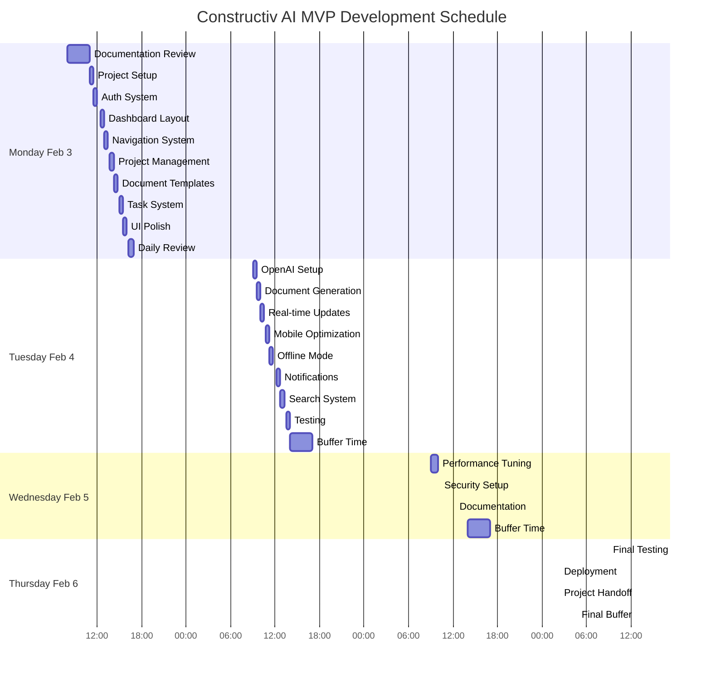

# Project Timeline - Constructiv AI MVP Development

## 1. Project Overview

- **Project Name:** Constructiv AI - Max Platform MVP
- **Primary Objective:** Launch MVP of voice-driven construction management platform by February 6, 2025
- **Timeline Owner:** Project Lead
- **Development Period:** February 3-6, 2025
- **Daily Schedule:**
  - Start: 9:00 AM (8:00 AM Monday)
  - Breaks: 15 mins every 90 mins
  - Lunch: 30 mins
  - End: 5:00 PM

## 2. Timeline Visualization

## 3. Detailed Sprint Breakdown

### Monday, February 3

#### Morning Documentation (8:00 - 11:00)

- Review and finalize all documentation
- Ensure alignment with project goals
- Prepare development environment

#### Development Sprints (11:00 - 5:00)

| Time | Sprint | Focus | Tasks |
|------|--------|-------|-------|
| 11:00-11:30 | S1 | Project Setup | - Initialize Next.js with Cursor AI - Configure Supabase - Setup CI/CD |
| 11:30-12:00 | S2 | Auth System | - Passwordless auth - Role-based access |
| 12:00-12:30 | LUNCH | | |
| 12:30-1:00 | S3 | Dashboard | - v0.dev layout generation - Responsive grid |
| 1:00-1:30 | S4 | Navigation | - Voice nav component - Mobile menu |
| 1:30-1:45 | BREAK | | |
| 1:45-2:15 | S5 | Project Mgmt | - Project schema - CRUD operations |
| 2:15-2:45 | S6 | Documents | - Base templates - AI prompts |
| 2:45-3:00 | BREAK | | |
| 3:00-3:30 | S7 | Tasks | - Kanban board - Drag-drop |
| 3:30-4:00 | S8 | UI | - shadcn/ui setup - Theme system |
| 4:00-4:15 | BREAK | | |
| 4:15-5:00 | S9 | Review | - Testing - Issue fixes |

### Tuesday, February 4

| Time | Sprint | Focus | Tasks |
|------|--------|-------|-------|
| 9:00-9:30 | S10 | AI Setup | - OpenAI integration - Voice parsing |
| 9:30-10:00 | S11 | Documents | - AI generation - PDF export |
| 10:00-10:30 | S12 | Real-time | - Supabase realtime - Presence |
| 10:30-10:45 | BREAK | | |
| 10:45-11:15 | S13 | Mobile | - Touch optimization - Responsive fixes |
| 11:15-11:45 | S14 | Offline | - Local storage - Sync system |
| 11:45-12:15 | LUNCH | | |
| 12:15-12:45 | S15 | Alerts | - Notification system - Toasts |
| 12:45-1:15 | S16 | Search | - Global search - Voice search |
| 1:15-1:30 | BREAK | | |
| 1:30-2:00 | S17 | Testing | - Cypress setup - Voice tests |
| 2:00-5:00 | Buffer | Catch-up | - Issue resolution - Additional features |

### Wednesday, February 5

| Time | Sprint | Focus | Tasks |
|------|--------|-------|-------|
| 9:00-10:00 | S18-19 | Performance | - Response optimization - Caching |
| 10:00-10:15 | BREAK | | |
| 10:15-11:45 | S20-22 | Security | - Data encryption - Access logs |
| 11:45-12:15 | LUNCH | | |
| 12:15-1:45 | S23-25 | Docs | - API documentation - User guides |
| 1:45-2:00 | BREAK | | |
| 2:00-5:00 | Buffer | Optimization | - Performance tuning - Issue resolution |

### Thursday, February 6

| Time | Sprint | Focus | Tasks |
|------|--------|-------|-------|
| 9:00-10:30 | S26-28 | Testing | - Cross-browser testing - Load testing |
| 10:30-10:45 | BREAK | | |
| 10:45-12:15 | S29-31 | Deploy | - Production build - Monitoring |
| 12:15-12:45 | LUNCH | | |
| 12:45-2:15 | S32-34 | Handoff | - Documentation - CI/CD setup |
| 2:15-5:00 | Buffer | Final | - Issue resolution - Polish |

## 4. Tool-Specific Guidelines

### Cursor AI Usage

- Use `/generate` for boilerplate code
- Enable pair programming mode
- Utilize code completion for efficiency
- Generate tests automatically

### v0.dev Integration

- Start with layout components
- Use AI-generated designs
- Export to shadcn/ui compatible code
- Maintain consistent styling

### Bolt.new Workflow

- Track sprint progress
- Automate PR creation
- Monitor development velocity
- Generate status reports

## 5. Success Metrics

- [ ] All sprints completed within timeboxes
- [ ] 95% voice command accuracy achieved
- [ ] Mobile-responsive design verified
- [ ] Core features functional and tested
- [ ] Documentation complete and reviewed

## 6. Risk Mitigation

- Buffer time allocated each afternoon
- AI tools configured for quick iterations
- Testing integrated throughout development
- Documentation updated in real-time

---

*Note: This timeline is designed to be flexible while maintaining core deliverable targets. Buffer times can be used for unexpected challenges or feature expansion.*
