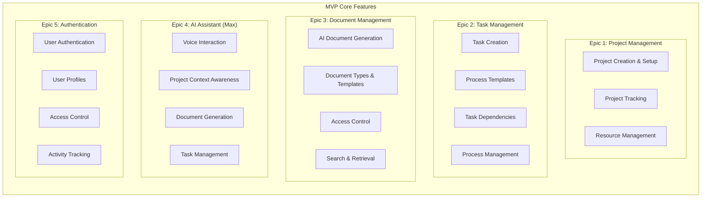
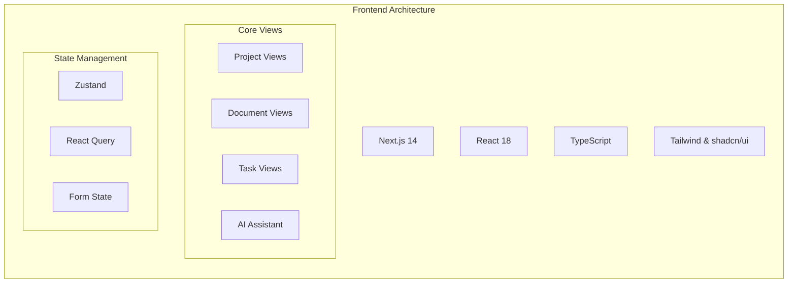
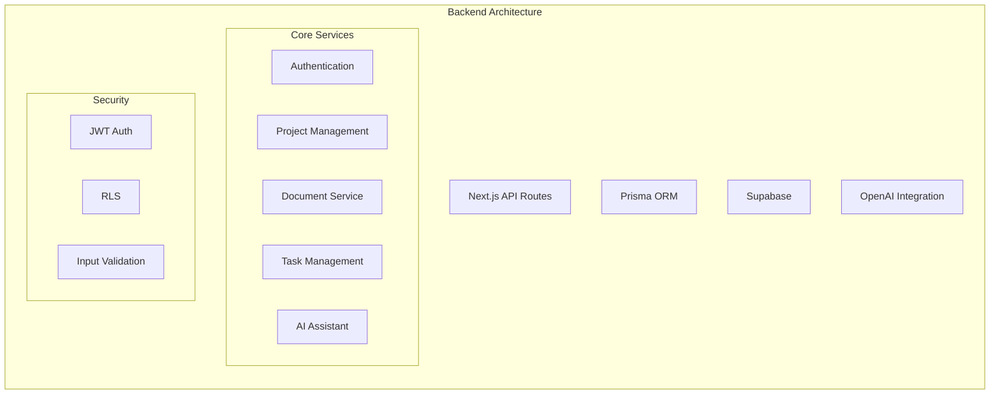
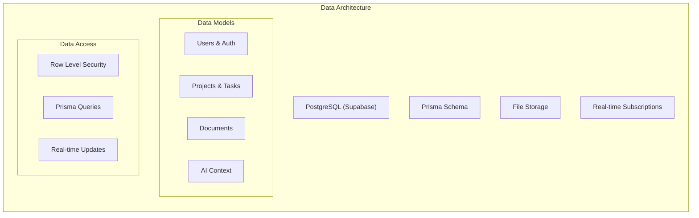
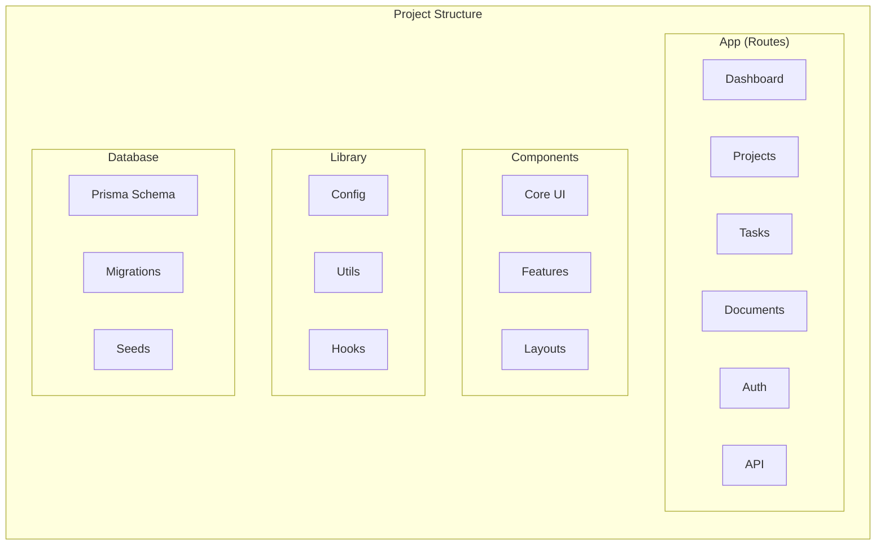
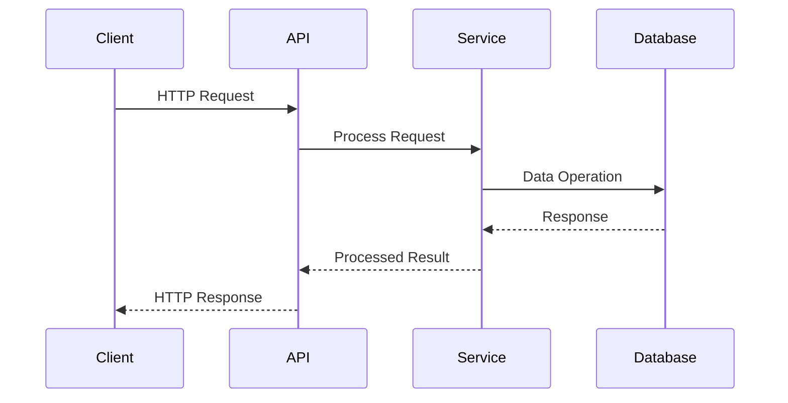
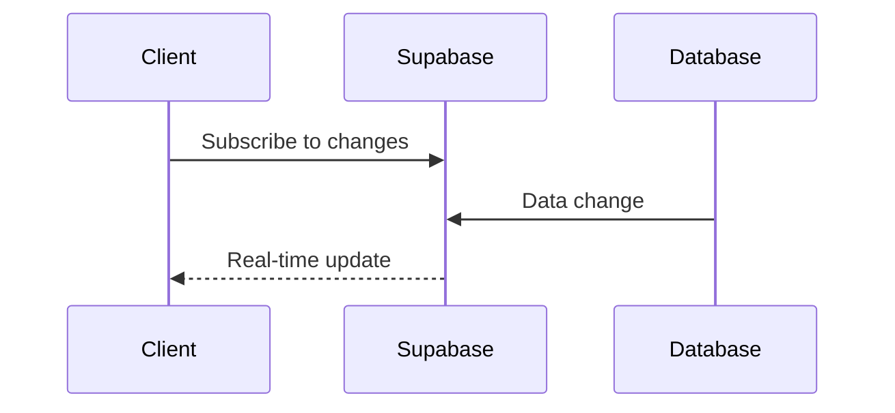
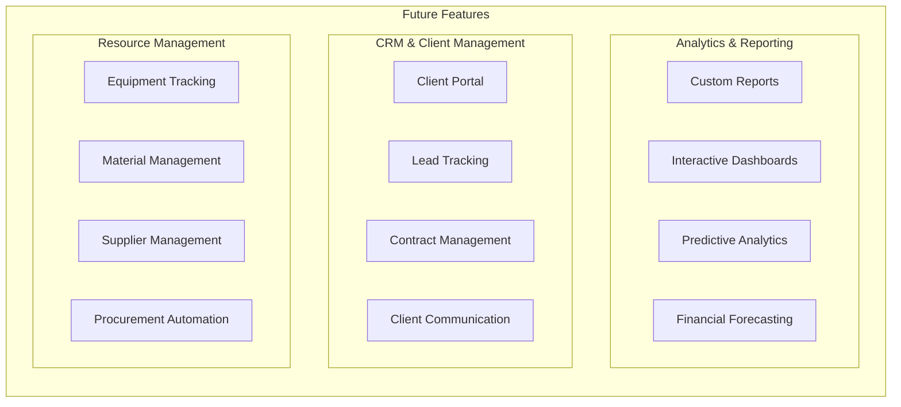
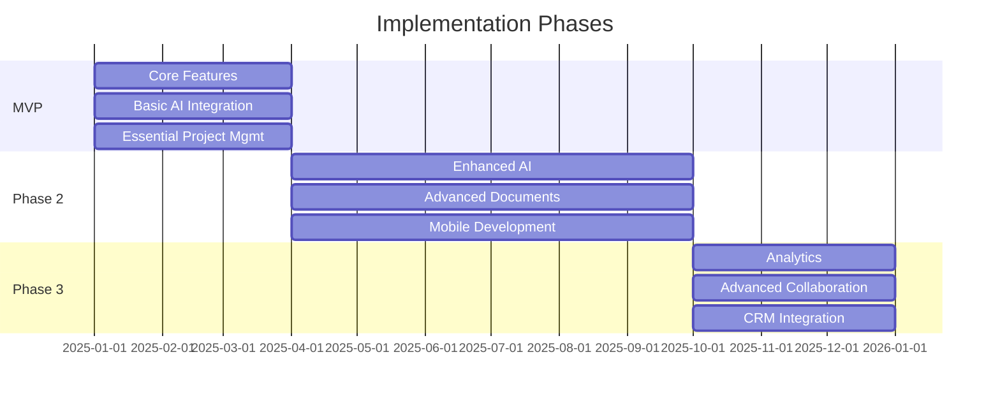

# System Architecture

## Overview

The Constructiv AI platform follows a modern serverless architecture, leveraging Next.js for both frontend and backend, Supabase for data storage and authentication, and OpenAI for AI capabilities.

## Core MVP Features

## System Layers

### 1. Presentation Layer (Frontend)

### 2. Application Layer (Backend)

### 3. Data Layer

## File Structure

## System Interactions

### 1. Request Flow

### 2. Real-time Flow

## Security Architecture

### 1. Authentication Flow

- Magic link email verification
- JWT token issuance
- Secure session management

### 2. Authorization

- Row Level Security (RLS)
- Role-based permissions
- API endpoint protection

### 3. Data Protection

- Encrypted storage
- Secure file handling
- Input validation

## Future Features & Expansion

## Implementation Timeline

## Performance & Monitoring

### 1. Performance Metrics

- API response times
- Database query performance
- Storage usage

### 2. Error Tracking

- Error rates
- API failures
- Authentication issues

### 3. Usage Analytics

- User activity
- Feature usage
- Resource consumption

## Development Workflow

### 1. Local Development

- Environment setup
- Database migrations
- Seed data

### 2. Deployment

- CI/CD pipeline
- Environment variables
- Database backups

### 3. Testing

- Unit testing
- Integration testing
- E2E testing
