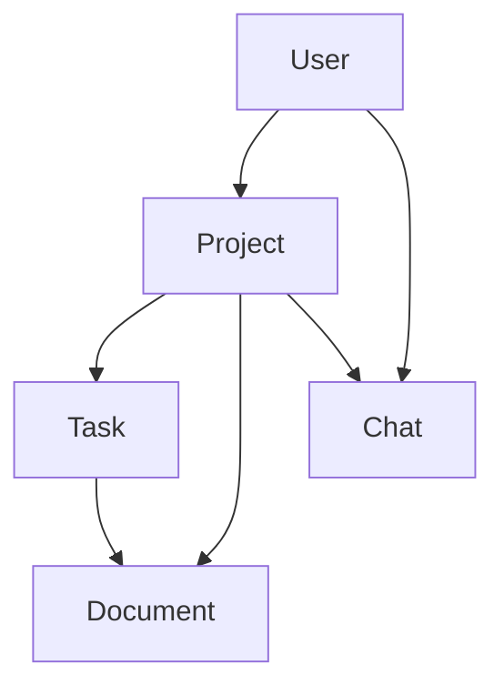

# Core Data Models

## Overview

Core data models and interfaces used throughout the Constructiv AI platform. These models form the foundation of our MVP implementation.

## Primary Models

### User 👤

- Authentication and profile management
- Role-based permissions
- User preferences and settings
- See: `user-data-model.md`

### Project 🏗️

- Project metadata and status
- Team member associations
- Timeline and milestones
- See: `project-data-model.md`

### Task 📋

- Task management and tracking
- Process templates and grouping
- Categories and completion status
- Parent-child relationships
- See: `task-data-model.md`

### Document 📄

- Document generation and storage
- Approval workflows
- Search functionality
- File uploads and versioning
- See: `document-data-model.md`

### AI Assistant (Max) 🤖

- Chat history management
- Voice command processing
- Project context awareness
- Document generation assistance
- See: `ai-assistant-data-model.md`

## Key Relationships

## Type Definitions

Shared TypeScript types are documented in each respective model file. Key shared types include:

- DocumentType
- TaskCategory
- ProjectStatus
- UserRole
- ApprovalStatus

## Implementation Notes

### Database Setup 🛠️

- All models use UUID primary keys
- Timestamps (created_at, updated_at) on all tables
- Row-level security implemented via Supabase
- Full-text search enabled where applicable

### Development Guidelines 📝

1. **Model Updates**
   - Always update TypeScript interfaces first
   - Then update corresponding SQL schema
   - Finally update any affected API endpoints

2. **Common Patterns**
   - Use soft deletes (deleted_at) for data preservation
   - Implement optimistic updates for better UX
   - Cache frequently accessed data
   - Use transactions for multi-table updates

3. **API Endpoints**
   - Base URL: `/api/v1/`
   - Models follow RESTful patterns:
     - GET /projects
     - POST /projects
     - GET /projects/:id
     - etc.

4. **Testing Checklist**
   - ✅ Model validation
   - ✅ Relationship integrity
   - ✅ Permission checks
   - ✅ API response format
   - ✅ Error handling

### Quick Start 🚀

1. Install dependencies: `npm install`
2. Set up Supabase: Copy `.env.example` to `.env`
3. Run migrations: `npm run migrate`
4. Start dev server: `npm run dev`
