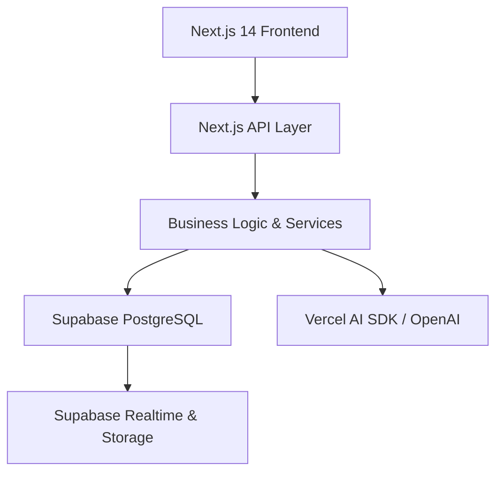

# Software Requirements Document (SRD)

**Project:** Constructiv AI - Max Platform  
**Version:** 1.0  
**Status:** Draft  
**Last Updated:** 2025-02-13

---

## 📋 Document Control

| Version | Date       | Author                   | Changes         | Reviewed By     |
|---------|-----------|--------------------------|-----------------|-----------------|
| 1.0     | 2025-02-13 | Chip Phillips / Team AI | Initial Draft   | [Reviewer Name] |

---

## 🎯 1. Introduction

### 1.1 Purpose

The Constructiv AI **Max Platform** is designed to significantly reduce administrative workload (by up to 50%) for small to midsize construction businesses through AI-powered automation and streamlined workflow features. This Software Requirements Document (SRD) outlines the platform’s functional, technical, and security requirements, ensuring clarity for all stakeholders.

Key objectives:

- Automate daily reports (voice → text → AI generation → PDF).
- Provide collaborative real-time project tracking (tasks, documents).
- Enable robust AI-driven document management and retrieval (OCR, embeddings, vector search).
- Support project management workflows with minimal overhead (templates, Kanban, resource allocation).
- Deliver a seamless user experience across web and mobile, supporting offline capabilities.

### 1.2 Project Scope

#### In-Scope Items

1. **Core Platform Features**  
   - User authentication with Supabase (passwordless Magic Link).  
   - Project & task management (Kanban, timeline, resource views).  
   - Document management (upload, AI generation, real-time collaboration).  
   - AI assistant (“Max”) for voice commands, chat, daily logs, and clarifications.  
   - Integration with a PostgreSQL-based backend (Supabase) for data storage and real-time events.  
   - AI-powered text generation and summarization with Vercel AI SDK + OpenAI GPT.  
   - OCR for handwritten notes (Tesseract or cloud services).  

2. **Technical Foundation**  
   - Monorepo with pnpm for efficient dependency management.  
   - Next.js 14 (App Router) for front-end and serverless API routes.  
   - Supabase local development (CLI) plus hosted environment.  
   - Basic role-based access controls (RBAC) and row-level security in Postgres.  
   - Infrastructure as code & containerization with Docker (for Supabase local).  

3. **Performance & Scalability**  
   - Support for real-time collaboration with minimal latency.  
   - API response and caching strategy for performance (React Query, SSR caching).  
   - Streaming AI responses for partial updates.  

#### Out-of-Scope Items

- Full e-commerce/payment system at MVP (Stripe integration is a future enhancement).
- Complex CRDT-based real-time conflict resolution (beyond basic concurrency or Y.js integration).
- Fine-tuning or self-hosting advanced LLMs (focusing primarily on OpenAI APIs).
- Advanced hardware setup or GPU hosting for local model inference.

#### Future Considerations

- Integration with other AI providers (Anthropic Claude, Google Gemini, etc.).
- Deeper CRDT-based real-time editing for Google-docs-like multi-user concurrency.
- Enhanced compliance modules (government/federal regulations).
- Automated scheduling with advanced Gantt chart functionalities.

### 1.3 Definitions and Acronyms

| Term       | Definition                                                                                                             |
|------------|------------------------------------------------------------------------------------------------------------------------|
| RLS        | Row-Level Security in PostgreSQL, controlling which rows each user can see.                                            |
| OCR        | Optical Character Recognition, used to convert handwritten/scanned text into machine-readable text.                    |
| RAG        | Retrieval-Augmented Generation: AI approach combining vector searches with GPT-like generation for grounded responses. |
| CRDT       | Conflict-free Replicated Data Type, enabling real-time collaboration without central conflict resolution.              |
| MVP        | Minimum Viable Product.                                                                                                |

### 1.4 System Context

The **Max Platform** fits within the broader construction ecosystem by providing:

- **Field Users** (mobile, on-site) with an easy way to record voice notes, upload photos, and fetch design details using AI.
- **Project Managers** (web) with collaborative dashboards, tasks, daily log generation, and simple resource management.
- **AI Integration** to unify project data (documents, notes, tasks) and reduce manual overhead, with a central Postgres database in Supabase.

---

## 💻 2. System Requirements

### 2.1 Technical Stack

- **Frontend Framework:**
  - Next.js 14 (App Router) & React 18  
  - TypeScript for static typing  
  - Tailwind CSS / Shadcn UI for styling  
- **Backend Technology:**  
  - Node.js v22 (Serverless routes within Next.js 14)  
  - Vercel AI SDK for AI integrations  
- **Database:**  
  - Supabase (PostgreSQL) for hosted DB & real-time features  
  - pgvector extension for embeddings and semantic search  
- **Cloud Infrastructure:**  
  - Hosted on Vercel for Next.js  
  - Local Docker-based environment with Supabase CLI for dev/testing  
- **Mobile Development:**  
  - Primarily responsive web app  
  - Potential future PWA approach with offline support  

### 2.2 System Architecture



**Description:**

1. **UI (Next.js + React)**: Renders the user interface, handles partial hydration, streams AI content, etc.  
2. **API Layer**: Next.js serverless API routes handle requests for projects, tasks, documents, and AI calls.  
3. **Business Logic**: Encapsulates domain logic (e.g., daily log generation, role checks, data transformations).  
4. **Database (Supabase)**: Stores persistent data (users, projects, tasks, docs). Includes row-level security, real-time updates, vector search.  
5. **Vercel AI (OpenAI)**: Provides GPT-based text generation, voice transcription (Whisper), advanced summarizations, streaming.  

### 2.3 Infrastructure Requirements

- **Hosting Requirements**  
  - Vercel for Next.js SSR and edge deployments.  
  - Supabase for database hosting and real-time features.  
  - Docker Desktop locally for supabase start/stop.  

- **Scaling Specifications**  
  - Horizontal scaling via Vercel’s serverless model.  
  - Database auto-scaling in Supabase based on usage tier.  

- **Backup Requirements**  
  - Regular daily backups of Supabase data.  
  - Versioned backups for 30 days (extendable if needed).  

- **Disaster Recovery Plans**  
  - Vercel environment variables & code are redeployable from Git.  
  - Supabase’s automated backups can restore DB states.  
  - Documented rollback procedures for production incidents.  

---

## 🔐 3. Security Requirements

### 3.1 Authentication & Authorization

1. **User Authentication Methods**  
   - Passwordless Magic Link via Supabase Auth (email-based).  
   - Potential future addition of OAuth providers.  

2. **Role-Based Access Control (RBAC)**  
   - Standard roles: `admin`, `project_manager`, `member`.  
   - Row-Level Security (RLS) to isolate project data by user/team in Postgres.  

3. **Session Management**  
   - Supabase client handles session tokens in local storage.  
   - Secure, short-lived JWT tokens with automatic refresh.  

4. **Password Policies**  
   - Not applicable for passwordless sign-on (Magic Link).  
   - If password-based login is introduced later, adopt min 8 chars, complexity rules, etc.  

### 3.2 Data Security

1. **Encryption Standards**  
   - TLS 1.2+ for data in transit.  
   - AES-256 or Postgres-native encryption for data at rest (Supabase host-level).  

2. **Data Privacy Compliance**  
   - GDPR compliance for EU-based users (right to erasure, data export).  
   - Potential US-based compliance (contractor data handling).  

3. **Audit Logging Requirements**  
   - Store user actions (create, update, delete) in an audit table or logs.  
   - AI generation logs for traceability (optional with user consent).  

4. **Data Retention Policies**  
   - Retain project and document data for the duration of an active subscription.  
   - Provide user-initiated deletion for personal data.  

---

## 📱 4. Interface Requirements

### 4.1 User Interface

1. **Responsive Design Requirements**  
   - Mobile-first approach for field usage.  
   - Desktop advanced dashboards (drag-and-drop Kanban, Gantt-like timelines).  
2. **Mobile-First Considerations**  
   - Large tap targets, voice command triggers, offline caching in PWA mode.  
3. **Accessibility Standards (WCAG)**  
   - Aim for WCAG AA: color contrast, keyboard navigation, ARIA roles.  
4. **UI/UX Guidelines**  
   - Clean, minimal design.  
   - Quick action buttons for AI tasks or daily logs.  

### 4.2 API Requirements

```typescript
interface APIEndpoint {
    path: string;
    method: 'GET' | 'POST' | 'PUT' | 'DELETE';
    authentication: boolean;
    rateLimit: number; // requests per minute
    response: {
        success: object;
        error: object;
    };
}
```

- **Example Endpoints**  
  - `POST /api/projects`: Creates a new project.  
  - `GET /api/projects/:id`: Fetch project details.  
  - `POST /api/ai/generateReport`: Submits voice transcript or text for daily log generation.  
  - `POST /api/documents/upload`: Chunked file upload.  

### 4.3 External Integrations

- **Supabase** (Authentication, Postgres, Realtime, Storage)  
  - RESTful + Realtime subscriptions for changes.  
- **OpenAI** (GPT-4, GPT-3.5, Whisper)  
  - Text generation, chat completions, voice transcription.  
- **Tesseract.js or Google Vision** (Handwritten OCR)  
  - For site images or scanned notes.  
- **Future**: Stripe (subscription management), external CRMs, or accounting systems.  

---

## 📊 5. Functional Requirements

### 5.1 Core Features

#### 5.1.1 Daily Log Generation (Voice → Text → AI → PDF)

- **Description**  
  Enables users to record a voice note (field updates), transcribe it to text (via Whisper), and generate a structured daily report using GPT-4. The final PDF is stored in Supabase Storage.  

- **User Stories**  
  1. *As a site engineer, I want to record my daily notes via voice so that I can generate a formal report without typing.*  
  2. *As a project manager, I want to review the AI-generated report, edit if needed, and store it in a shared folder.*  

- **Acceptance Criteria**  
  - The system transcribes at least 90% of words accurately.  
  - The user can review and make edits before finalizing.  
  - PDF is generated and stored with correct metadata (date, project ID).  

- **Technical Implementation Details**  
  - Next.js Route: `POST /api/logs/voice`  
  - Integrates with Whisper API for transcription.  
  - GPT-4 prompt: “Generate daily construction log” with custom instructions.  
  - PDF generation via pdfkit or Puppeteer.  

- **Dependencies**  
  - OpenAI API for transcription and text generation.  
  - Supabase Storage for storing PDF.  

#### 5.1.2 Project & Task Management

- **Description**  
  Provide a collaborative interface to create, assign, and track tasks. Real-time updates on project boards via Supabase Realtime.  

- **User Stories**  
  1. *As a project manager, I want to create tasks with deadlines so that my team has clear assignments.*  
  2. *As a team member, I want to view tasks in a Kanban board to organize my workflow.*  

- **Acceptance Criteria**  
  - Real-time updates visible to all team members when tasks change status.  
  - Kanban view includes drag-and-drop transitions.  
  - Each task has associated metadata (priority, assignees, deadlines).  

- **Technical Implementation Details**  
  - RLS ensures only authorized users can see or modify certain tasks.  
  - React Query for caching & updates, plus optimistic UI for changes.  

- **Dependencies**  
  - Supabase Realtime for push updates.  
  - Next.js serverless routes for CRUD.  

#### 5.1.3 Document Management & AI-Powered Search

- **Description**  
  A central library for storing and retrieving documents. AI chunking with pgvector embeddings to allow semantic search (RAG).  

- **User Stories**  
  1. *As a user, I want to upload site photos or PDFs so they can be accessed later.*  
  2. *As a manager, I want to quickly find relevant specs or drawings using a search bar.*  

- **Acceptance Criteria**  
  - Ability to upload multi-page PDFs or images.  
  - AI-based search that returns relevant paragraphs or sections.  
  - RLS-based security for documents.  

- **Technical Implementation Details**  
  - `/api/documents/upload` with chunked file approach.  
  - Embedding with `text-embedding-ada-002` & pgvector for retrieval.  
  - Summaries or content previews via GPT.  

- **Dependencies**  
  - Supabase Storage for files, Postgres with `vector` extension.  

#### 5.1.4 Max AI Assistant (Voice & Chat)

- **Description**  
  A unified AI helper for voice commands, chat-based Q&A, and quick actions (e.g., “Generate daily report,” “Summarize site issues”).  

- **User Stories**  
  1. *As a field worker, I want to quickly ask: “What’s left to install for Project X?” and receive an AI-assisted answer from relevant documents.*  
  2. *As a project manager, I want to issue a voice command to “Create a new task for the HVAC subcontractor.”*  

- **Acceptance Criteria**  
  - AI assistant uses user-specific context (project data, user preferences).  
  - Voice commands recognized with > 90% accuracy for standard construction terms.  
  - Streaming responses to show partial results.  

- **Technical Implementation Details**  
  - Vercel AI SDK for LLM calls.  
  - Supabase Realtime to push newly created tasks if commanded by voice.  
  - Possible server action or route handler for partial streaming.  

- **Dependencies**  
  - OpenAI for GPT-4, voice transcription.  
  - Supabase (user data, tasks, documents).  

### 5.2 Business Rules

- **Project Ownership**: Only project owners or assigned managers can edit or delete a project.  
- **Task Lifecycle**: A task can be `Open`, `In Progress`, `Blocked`, or `Done`.  
- **Document Visibility**: Documents inherit project-level visibility unless explicitly shared.  
- **Voice Command Rate Limit**: Limit 10 voice requests per minute to prevent abuse.  

---

## ⚡ 6. Performance Requirements

### 6.1 Load Requirements

- **Concurrent Users**: The system should handle up to 500 concurrent active users in MVP.  
- **Response Time**:  
  - <= 2 seconds for standard UI interactions (task creation, doc retrieval).  
  - Streaming AI responses begin within 1-2 seconds.  
- **Throughput**: Capable of 50 requests/sec across serverless routes.  
- **Resource Utilization**: CPU usage on Vercel < 80% at peak traffic.  

### 6.2 Scalability

- **Horizontal Scaling**:  
  - Vercel serverless automatically scales front-end & API routes.  
  - Supabase can scale horizontally or vertically as usage grows.  
- **Load Balancing**:  
  - Built into Vercel’s edge network.  
- **Caching Strategy**:  
  - React Query for client-side caching of tasks, projects.  
  - Edge caching for static assets.  
- **Caching & Rate-Limiting**:  
  - In-memory or Redis-based approach for AI rate limiting if usage spikes.  

---

## 📝 7. Data Requirements

### 7.1 Data Models

```typescript
interface ProjectData {
    id: string;
    name: string;
    status: 'ACTIVE' | 'ARCHIVED';
    startDate?: Date;
    endDate?: Date;
    budget?: number;
    // Additional fields...
}

interface TaskData {
    id: string;
    projectId: string;
    title: string;
    status: 'OPEN' | 'IN_PROGRESS' | 'BLOCKED' | 'DONE';
    assigneeId?: string;
    dueDate?: Date;
    // ...
}

interface DocumentData {
    id: string;
    projectId: string;
    filePath: string;
    embedding?: number[]; // vector for AI search
    // ...
}
```

### 7.2 Database Requirements

- **Schema Design**  
  - Tables for `users`, `projects`, `tasks`, `documents`, `ai_sessions`.  
- **Data Relationships**  
  - 1:N `projects` to `tasks`.  
  - 1:N `projects` to `documents`.  
  - N:N `users` to `projects` (teams).  
- **Indexing Strategy**  
  - B-tree indexes on foreign keys, time-based queries.  
  - Vector index (pgvector) for semantic search.  
- **Query Optimization**  
  - Use Supabase policies for row-level security, minimal overhead.  

---

## 🔄 8. Development Requirements

### 8.1 Development Environment

- **IDE Configuration**  
  - VS Code recommended, ESLint & Prettier for code formatting.  
- **Version Control**  
  - Git (GitHub or GitLab), main & dev branches, feature branches for new features.  
- **Code Style Guide**  
  - TypeScript strict mode, ES2022.  
  - Pre-commit checks with lint & test.  
- **Documentation Standards**  
  - JSDoc or TSDoc for critical modules.  
  - Confluence or similar knowledge base for feature documentation.  

### 8.2 Testing Requirements

- **Unit Testing**  
  - Jest or Vitest for logic, React Testing Library for components.  
- **Integration Testing**  
  - Next.js route tests with supertest.  
  - Database integration tests with Supabase test instance.  
- **E2E Testing**  
  - Playwright or Cypress to simulate user flows (login, tasks, doc generation).  
- **Performance Testing**  
  - k6 or Artillery for load/stress tests.  
- **Security Testing**  
  - Basic vulnerability scans (Dependabot, Snyk).  
  - RLS policy testing for data isolation.  

### 8.3 Deployment Requirements

- **CI/CD Pipeline**  
  - Git-based triggers (GitHub Actions).  
  - Automatic build & test on push.  
  - Deploy to Vercel for staging & production.  
- **Environment Setup**  
  - .env files for dev vs. production.  
  - Supabase project references & keys.  
- **Configuration Management**  
  - Store environment variables in Vercel secrets or GitHub Actions secrets.  
- **Monitoring Setup**  
  - Vercel analytics + logs.  
  - Supabase usage metrics.  
  - Optionally, Datadog or Sentry for error tracking.  

---

## 📈 9. Quality Attributes

### 9.1 Reliability

- **Uptime Requirements**: 99.9% monthly uptime for production.  
- **Fault Tolerance**: Graceful fallback if AI or Supabase is temporarily unavailable.  
- **Error Handling**: Return structured error messages, let user retry or revert.  
- **Recovery Procedures**: Rolling back to previous deployment if new release fails.  

### 9.2 Maintainability

- **Code Organization**: Monorepo with pnpm, multiple packages for front-end, server, shared libs.  
- **Documentation Requirements**: Updated README and wiki for major workflows.  
- **Modularity**: Each feature encapsulated in Next.js route or React component.  
- **Technical Debt Management**: Regular backlog grooming, code reviews.  

### 9.3 Usability

- **User Experience Goals**: Streamlined, minimal clicks for daily tasks.  
- **Accessibility Requirements**: Basic compliance with WCAG 2.1 AA.  
- **Internationalization**: Future readiness for multi-language support.  
- **Help Documentation**: In-app tooltips or a knowledge base for new users.  

---

## 📦 10. Constraints and Limitations

### 10.1 Technical Constraints

- **Browser Support**  
  - Latest Chrome, Firefox, Safari, Edge.  
  - Mobile Safari & Chrome (iOS/Android).  
- **Device Compatibility**  
  - Desktop, tablet, mobile usage.  
  - Some advanced features (audio recording) require modern devices.  
- **Network Requirements**  
  - 4G or better recommended for voice uploads.  
  - Offline usage limited to cached tasks & docs (no AI generation offline).  
- **Storage Limitations**  
  - Standard Supabase plan: 2GB or 10GB (depending on tier).  
  - Extra cost for large audio/video files.  

### 10.2 Business Constraints

- **Budget Limitations**  
  - Minimally feasible infrastructure on Vercel + Supabase free or low-tier plan initially.  
- **Timeline Requirements**  
  - MVP targeted within 3 months from development start.  
- **Resource Constraints**  
  - Small dev team (2-3 engineers).  
- **Legal Requirements**  
  - Must comply with general data protection regulations.  
  - Ensure consent for voice transcription storage.  

---

## 📋 11. Acceptance Criteria

### 11.1 User Acceptance Testing

1. **Test Scenarios**  
   - *Scenario A:* A new user signs up with email Magic Link and is redirected to the dashboard.  
   - *Scenario B:* A project manager creates a project, invites a user, and that user sees tasks in real-time.  
   - *Scenario C:* Voice-based daily report generation using AI, user reviews the draft, and approves it.  
   - *Scenario D:* Searching for a specification document using the AI search bar.  
2. **Success Metrics**  
   - 80% of test participants complete daily log creation in < 2 minutes.  
   - 90% transcription accuracy in voice test with standard English.  
   - Under 2-second average response time for common tasks.  
3. **Sign-off Requirements**  
   - All critical bugs resolved (severity 1 & 2).  
   - Key features tested across device types.  
4. **Stakeholder Approval Process**  
   - Product Owner sign-off after final UAT.  
   - Technical Lead QA confirmation.  

---

## 📚 Appendices

### Appendix A: Technical Diagrams

- High-level architecture diagram (Section 2.2).
- Detailed architecture diagrams

```scss
┌──────────────────────────────────────────────────────────────────────────────────────────────────┐
│                                    CLIENT (Next.js + React)                                       │
│  1) Next.js 14 (App Router) + React 18 + TypeScript                                             │
│  2) Tailwind CSS + shadcn/ui (UI & Styling)                                                     │
│  3) Zustand (Light State Management)                                                             │
│  4) React Query (Server Data Caching)                                                            │
│  5) React Hook Form + Zod (Form & Validation)                                                    │
│                                                                                                  │
│    -- User Actions & Input -->                                                                   │
│       - CRUD operations via Next.js API routes                                                   │
│       - AI/Voice commands via Vercel AI SDK 4.0                                                  │
│       - Project/Task visualization via Kanban/Timeline views                                     │
│                                                                                                  │
└──────────────────────────────────────────────────────────────────────────────────────────────────┘

┌──────────────────────────────────────────────────────────────────────────────────────────────────┐
│                                   SERVER (Next.js Backend)                                        │
│  1) Next.js 14 API Routes                                                                        │
│  2) TypeScript + Zod Validation                                                                  │
│  3) Prisma ORM                                                                                   │
│     • Type-safe Database Operations                                                              │
│     • Schema Management                                                                          │
│     • Migrations                                                                                 │
│  4) Supabase Client                                                                              │
│     • Authentication                                                                             │
│     • Storage Management                                                                         │
│  5) Vercel AI SDK 4.0                                                                            │
│     • OpenAI GPT-4 Integration                                                                   │
│     • Whisper Voice Processing                                                                   │
│                                                                                                  │
└──────────────────────────────────────────────────────────────────────────────────────────────────┘

┌──────────────────────────────────────────────────────────────────────────────────────────────────┐
│                                   DATA LAYER (Supabase + Prisma)                                 │
│  1) PostgreSQL Database                                                                          │
│     • Prisma Schema & Migrations                                                                 │
│     • Users & Authentication                                                                     │
│     • Projects & Tasks                                                                           │
│     • Documents & Storage                                                                        │
│     • AI Assistant Conversations                                                                 │
│  2) Row Level Security                                                                           │
│  3) Real-time Subscriptions                                                                      │
│  4) Full-text Search                                                                             │
│                                                                                                  │
└──────────────────────────────────────────────────────────────────────────────────────────────────┘
```

- Detailed user flow diagrams [user-flow.md](user-flow.md).
- Real-time collaboration sequence diagrams.

### Appendix B: API Documentation

- Detailed API reference
- **AI Assistant API** route [z-max-mvp-25/docs/6-backend/ai-assistant/routes.md](routes.md)
- **AI Assistant API** examples [z-max-mvp-25/docs/6-backend/ai-assistant/examples.md](examples.md)

- **Authentication API** route [z-max-mvp-25/docs/6-backend/authentication/routes.md](routes.md)
- **Authentication API** examples [z-max-mvp-25/docs/6-backend/authentication/flows.md](flows.md)

- **Common API** route [z-max-mvp-25/docs/6-backend/common/conventions.md](conventions.md)
- **Common API** examples [z-max-mvp-25/docs/6-backend/common/error-handling.md](error-handling.md)
- **Common API** rate limits [z-max-mvp-25/docs/6-backend/common/rate-limits.md](rate-limits.md)
- **Common API** utilities [z-max-mvp-25/docs/6-backend/common/utilities.md](utilities.md)
- **Common API** security [z-max-mvp-25/docs/6-backend/common/security.md](security.md)
- **Common API** README [z-max-mvp-25/docs/6-backend/common/README.md](README.md)

- **Document API** route [z-max-mvp-25/docs/6-backend/documents/routes.md](routes.md)
- **Document API** examples [z-max-mvp-25/docs/6-backend/documents/examples.md](examples.md)

- **Project API** route [z-max-mvp-25/docs/6-backend/projects/routes.md](routes.md)
- **Project API** examples [z-max-mvp-25/docs/6-backend/projects/examples.md](examples.md)

- **Task API** route [z-max-mvp-25/docs/6-backend/tasks/routes.md](routes.md)
- **Task API** examples [z-max-mvp-25/docs/6-backend/tasks/examples.md](examples.md)

### Appendix C: Data Dictionary

- Detailed schema descriptions for each table (users, projects, tasks, documents, etc.).
- **AI Assistant** data model [z-max-mvp-25/docs/4-models/data-models/ai-assistant-data-model.md](ai-assistant-data-model.md)
- **Core-Models** data model [z-max-mvp-25/docs/4-models/data-models/core-models.md](core-models.md)
- **Document-Models** data model [z-max-mvp-25/docs/4-models/data-models/document-data-model.md](document-data-model.md)
- **Project-Models** data model [z-max-mvp-25/docs/4-models/data-models/project-data-model.md](project-data-model.md)
- **Task-Models** data model [z-max-mvp-25/docs/4-models/data-models/task-data-model.md](task-data-model.md)
- **User-Models** data model [z-max-mvp-25/docs/4-models/data-models/user-data-model.md](user-data-model.md)

- **API-Interfaces** [z-max-mvp-25/docs/4-models/interfaces/api-interfaces.md](api-interfaces.md)
- **Enums** [z-max-mvp-25/docs/4-models/enums/constants.md](constants.md)
Field constraints, default values, enumerations.

---

## Sign-off

| Role             | Name            | Signature | Date       |
|------------------|-----------------|-----------|-----------|
| Technical Lead   | [Tech Lead]     |           |           |
| System Architect | [Arch Lead]     |           |           |
| Security Lead    | [Security Lead] |           |           |
| Product Owner    | [PO Name]       |           |           |

---

## Notes

1. All requirements must be testable and measurable.  
2. Regular reviews and updates to this SRD are required.  
3. Version control for the SRD must be maintained in the main repo.  
4. Security measures must align with industry standards and Supabase best practices.  
