# User Flows

## Overview

Key user flows for the Constructiv AI platform MVP, organized by feature area.

## 1. Authentication & Onboarding


## 2. Project Management


## 3. Task Management


## 4. Document Management


## 5. Daily Log Creation


### Daily Log States & Components


### Daily Log Components


### Daily Log Data Flow

```mermaid
sequenceDiagram
    participant U as User
    participant M as Max AI
    participant DB as Supabase
    participant S as Storage
    participant R as RAG System

    U->>M: Voice Recording
    M->>M: Transcribe
    M->>M: Analyze Content
    M-->>U: Stream Clarity Component
    U->>M: Yes/No Answers
    M->>M: Generate Report
    M-->>U: Stream Report Preview
    U->>M: Approve Report
    
    par Document Processing
        M->>DB: Store Report Data
        M->>S: Generate & Store PDF
        M->>R: Process & Chunk Document
    end
    
    DB-->>U: Update UI
    S-->>U: PDF Available
    U->>M: Feedback (👍/👎)
    M->>DB: Store User Preferences
```



### Document Organization & Learning


### AI Document Generation Pattern


### Document Management Features


## 6. AI Assistant Interaction


## Key User Stories

### Project Manager

1. Create new construction project
2. Invite team members
3. Set up project timeline
4. Monitor task progress
5. Review and approve documents

### Team Member

1. View assigned tasks
2. Update task status
3. Generate field reports
4. Upload site photos
5. Collaborate on documents

### Admin

1. Manage user permissions
2. Create document templates
3. Monitor system usage
4. Configure AI settings
5. Generate reports

## User Interface States

### Loading States

- Skeleton loaders for lists
- Progress indicators for uploads
- Streaming indicators for AI generation

### Error States

- Network connectivity issues
- Permission denied messages
- Validation error displays
- AI processing failures

### Success States

- Task completion notifications
- Document approval confirmations
- Save/update confirmations
- AI generation completion

## Accessibility Considerations

- Voice command alternatives
- Keyboard navigation support
- Screen reader compatibility
- High contrast mode support
- Mobile responsiveness

```
