# App Stack Data Flow

```scss
┌──────────────────────────────────────────────────────────────────────────────────────────────────┐
│                                    CLIENT (Next.js + React)                                       │
│  1) Next.js 14 (App Router) + React 18 + TypeScript                                             │
│  2) Tailwind CSS + shadcn/ui (UI & Styling)                                                     │
│  3) Zustand (Light State Management)                                                             │
│  4) React Query (Server Data Caching)                                                            │
│  5) React Hook Form + Zod (Form & Validation)                                                    │
│                                                                                                  │
│    -- User Actions & Input -->                                                                   │
│       - CRUD operations via Next.js API routes                                                   │
│       - AI/Voice commands via Vercel AI SDK 4.0                                                  │
│       - Project/Task visualization via Kanban/Timeline views                                     │
│                                                                                                  │
└──────────────────────────────────────────────────────────────────────────────────────────────────┘

┌──────────────────────────────────────────────────────────────────────────────────────────────────┐
│                                   SERVER (Next.js Backend)                                        │
│  1) Next.js 14 API Routes                                                                        │
│  2) TypeScript + Zod Validation                                                                  │
│  3) Prisma ORM                                                                                   │
│     • Type-safe Database Operations                                                              │
│     • Schema Management                                                                          │
│     • Migrations                                                                                 │
│  4) Supabase Client                                                                              │
│     • Authentication                                                                             │
│     • Storage Management                                                                         │
│  5) Vercel AI SDK 4.0                                                                            │
│     • OpenAI GPT-4 Integration                                                                   │
│     • Whisper Voice Processing                                                                   │
│                                                                                                  │
└──────────────────────────────────────────────────────────────────────────────────────────────────┘

┌──────────────────────────────────────────────────────────────────────────────────────────────────┐
│                                   DATA LAYER (Supabase + Prisma)                                 │
│  1) PostgreSQL Database                                                                          │
│     • Prisma Schema & Migrations                                                                 │
│     • Users & Authentication                                                                     │
│     • Projects & Tasks                                                                           │
│     • Documents & Storage                                                                        │
│     • AI Assistant Conversations                                                                 │
│  2) Row Level Security                                                                           │
│  3) Real-time Subscriptions                                                                      │
│  4) Full-text Search                                                                             │
│                                                                                                  │
└──────────────────────────────────────────────────────────────────────────────────────────────────┘
```

## Key Data Flows

### 1. React Query Cache Flow

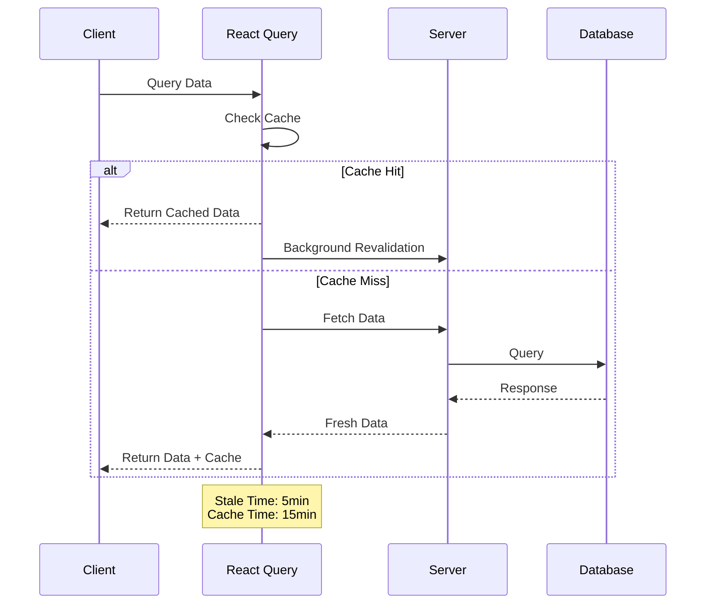

#### Implementation Details

```typescript
// src/lib/queries/useProjects.ts
export const useProjects = () => {
  return useQuery({
    queryKey: ['projects'],
    queryFn: async () => {
      const { data, error } = await supabase
        .from('projects')
        .select('*')
        .order('created_at', { ascending: false });
      if (error) throw error;
      return data;
    },
    staleTime: 5 * 60 * 1000,    // 5 minutes
    cacheTime: 15 * 60 * 1000,   // 15 minutes
    retry: 3,
  });
};
```

#### Best Practices

- Use `queryKey` arrays for granular cache invalidation
- Implement background fetching with `staleTime`
- Configure appropriate `cacheTime` based on data volatility
- Enable automatic retries for failed requests

### 2. Error Handling & Retry Flow

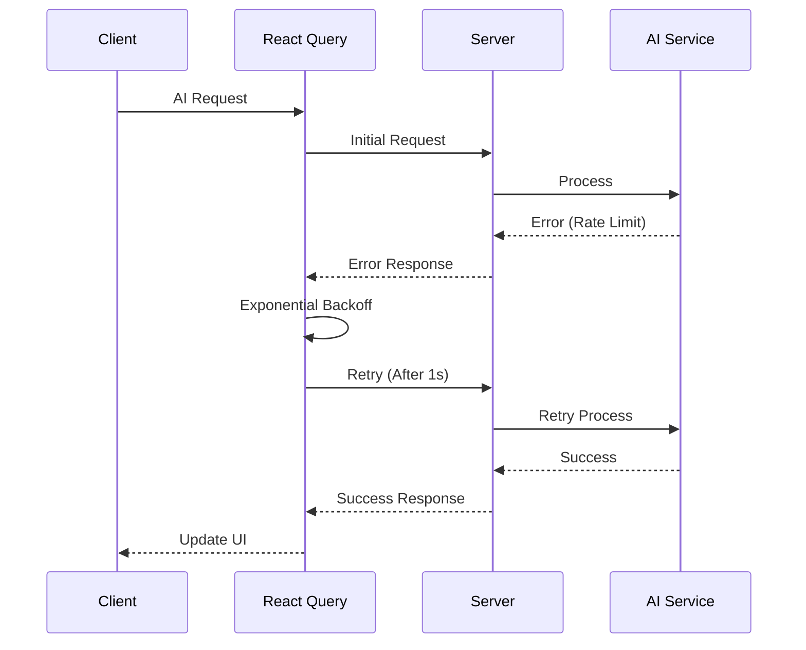

#### Implementation Details (useAICompletion.ts)

```typescript
// src/lib/ai/useAICompletion.ts
export const useAICompletion = (prompt: string) => {
  return useMutation({
    mutationFn: async () => {
      const response = await fetch('/api/v1/ai/complete', {
        method: 'POST',
        body: JSON.stringify({ prompt }),
        headers: { 'Content-Type': 'application/json' },
      });
      
      if (!response.ok) {
        throw new Error('AI request failed');
      }
      
      const data = await response.json();
      return data;
    },
    retry: (failureCount, error) => {
      if (error.status === 429) return true; // Rate limit
      if (failureCount < 3) return true;
      return false;
    },
    retryDelay: (attemptIndex) => Math.min(1000 * 2 ** attemptIndex, 30000),
  });
};
```

#### Best Practices (useAICompletion.ts)

- Implement exponential backoff for retries
- Handle rate limits gracefully
- Provide clear error feedback to users
- Log errors for monitoring

### 3. Optimistic Updates Flow  

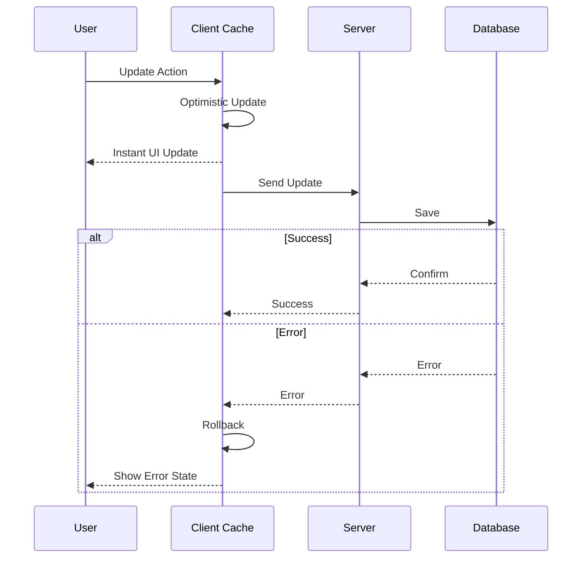

#### Implementation Details (useUpdateTask.ts)

```typescript
// src/lib/mutations/useUpdateTask.ts
export const useUpdateTask = () => {
  const queryClient = useQueryClient();
  
  return useMutation({
    mutationFn: async ({ id, status }: UpdateTaskInput) => {
      const { data, error } = await supabase
        .from('tasks')
        .update({ status })
        .eq('id', id)
        .single();
        
      if (error) throw error;
      return data;
    },
    onMutate: async (newTask) => {
      await queryClient.cancelQueries(['tasks']);
      const previousTasks = queryClient.getQueryData(['tasks']);
      
      queryClient.setQueryData(['tasks'], (old: Task[]) => 
        old.map(task => 
          task.id === newTask.id ? { ...task, ...newTask } : task
        )
      );
      
      return { previousTasks };
    },
    onError: (err, newTask, context) => {
      queryClient.setQueryData(['tasks'], context.previousTasks);
    },
    onSettled: () => {
      queryClient.invalidateQueries(['tasks']);
    },
  });
};
```

#### Best Practices (useUpdateTask.ts)

- Implement proper rollback mechanisms
- Update cache immediately for better UX
- Handle race conditions
- Provide loading and error states

### 4. Chunked Upload Flow

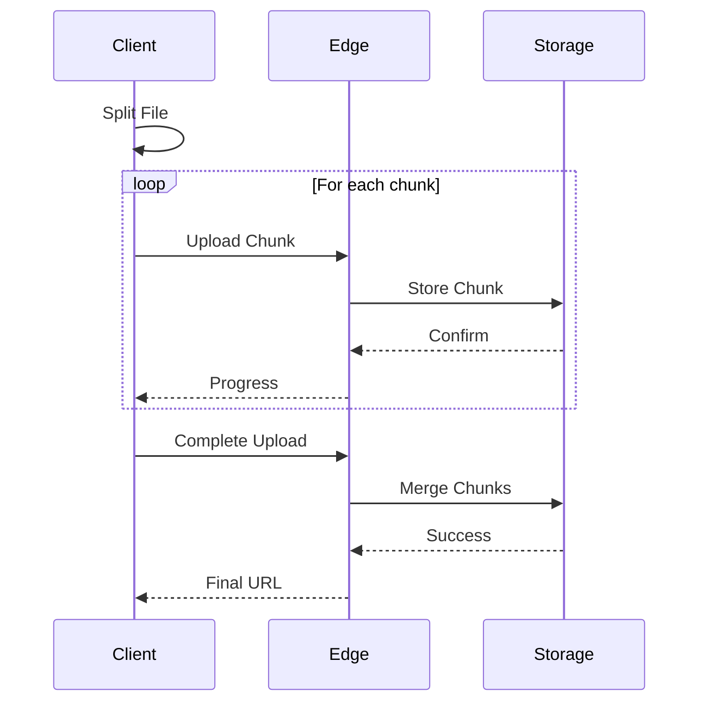

#### Implementation Details (useChunkedUpload.ts)

```typescript
// src/lib/uploads/useChunkedUpload.ts
export const useChunkedUpload = () => {
  return useMutation({
    mutationFn: async (file: File) => {
      const chunkSize = 5 * 1024 * 1024; // 5MB chunks
      const chunks = Math.ceil(file.size / chunkSize);
      const uploadId = uuidv4();
      
      for (let i = 0; i < chunks; i++) {
        const chunk = file.slice(
          i * chunkSize,
          Math.min((i + 1) * chunkSize, file.size)
        );
        
        const formData = new FormData();
        formData.append('chunk', chunk);
        formData.append('uploadId', uploadId);
        formData.append('chunkIndex', String(i));
        
        await fetch('/api/v1/upload/chunk', {
          method: 'POST',
          body: formData,
        });
      }
      
      // Complete upload
      const response = await fetch('/api/v1/upload/complete', {
        method: 'POST',
        body: JSON.stringify({ uploadId }),
        headers: { 'Content-Type': 'application/json' },
      });
      
      return response.json();
    },
  });
};
```

#### Best Practices (useChunkedUpload.ts)

- Use appropriate chunk sizes (5MB recommended)
- Implement progress tracking
- Handle upload interruptions
- Cleanup incomplete uploads

## Performance Considerations

### Caching Strategy

- Edge caching for static assets (1 year with hash-based filenames)
- API response caching (5 minutes)
- React Query client-side caching (15 minutes)
- Supabase real-time subscription caching

### SDK-Specific Optimizations

1. Vercel AI SDK 4.0
   - Use streaming responses for AI completions
   - Implement proper error boundaries
   - Handle rate limiting with exponential backoff
   - Cache frequently used AI responses

2. Supabase 125
   - Use Row Level Security (RLS)
   - Implement connection pooling
   - Enable real-time subscriptions selectively
   - Use prepared statements for complex queries

### Monitoring and Debugging

- Implement OpenTelemetry for tracing
- Use Vercel Analytics for performance monitoring
- Log critical operations and errors
- Monitor cache hit rates and API response times

### 1. Project Management Flow

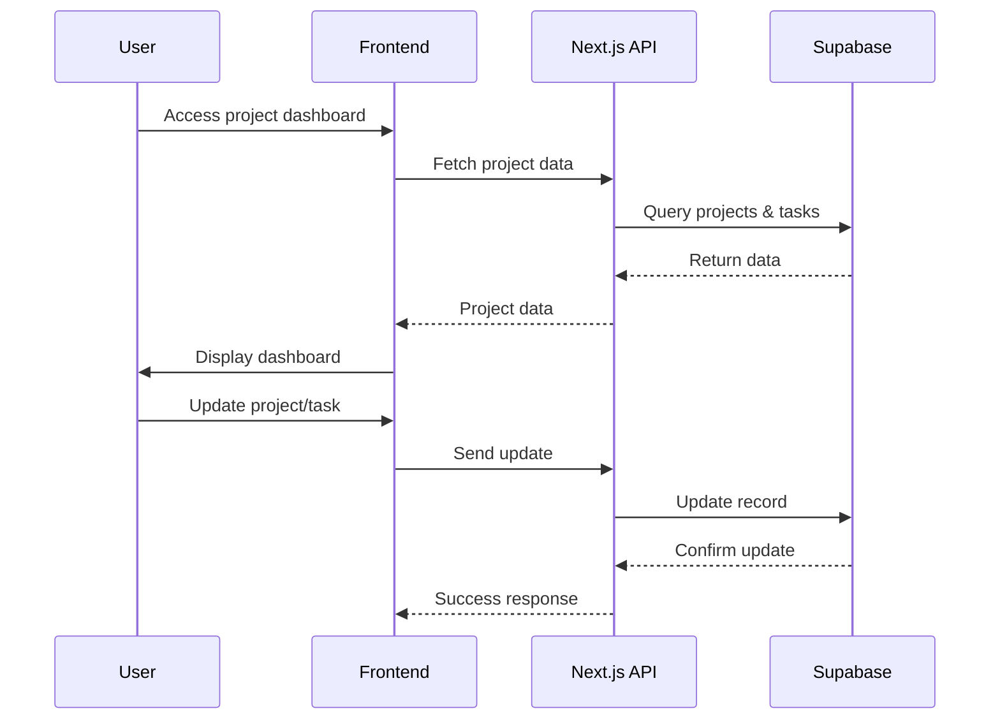

### 2. Document Management Flow

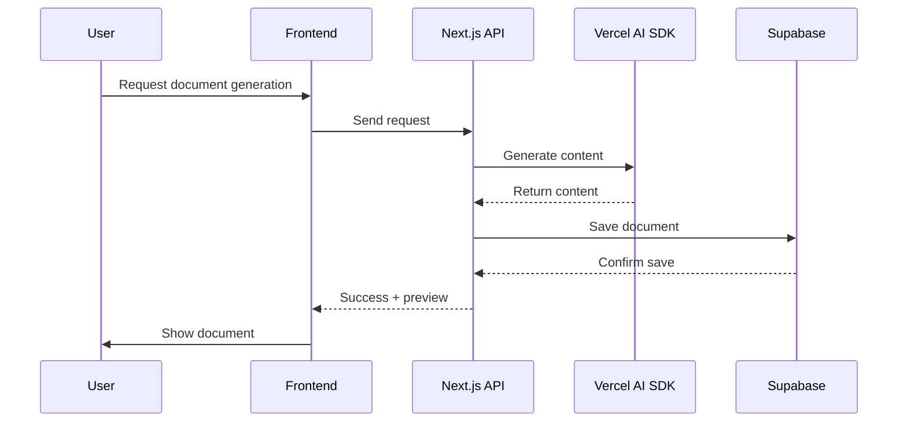

### 3. AI Assistant Flow

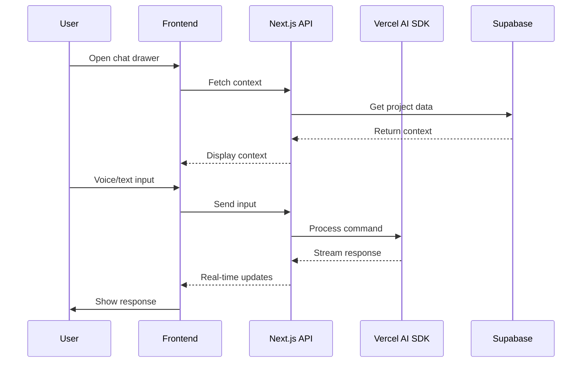

### 4. Process Template Flow

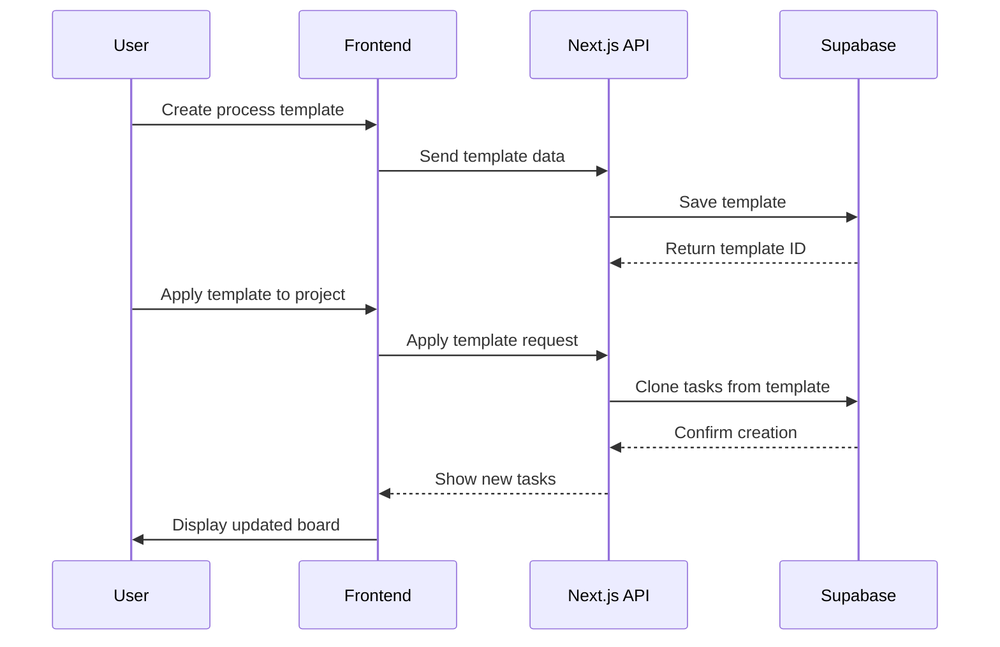

### 5. Document Search Flow

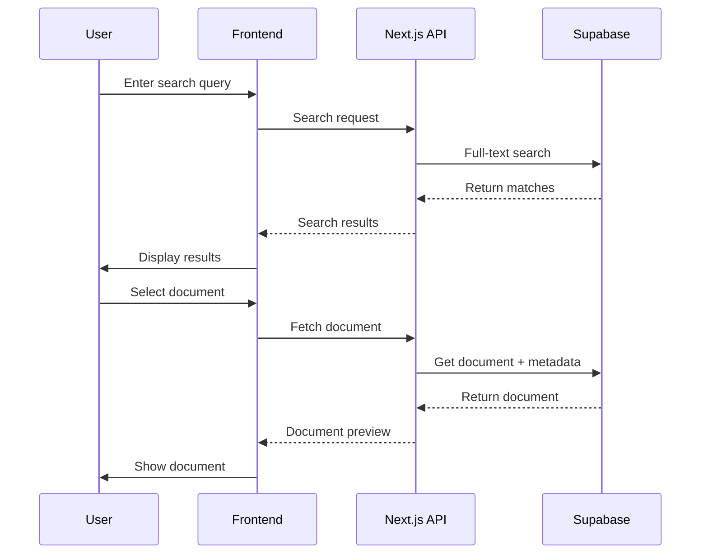

### 6. Voice Document Generation Flow

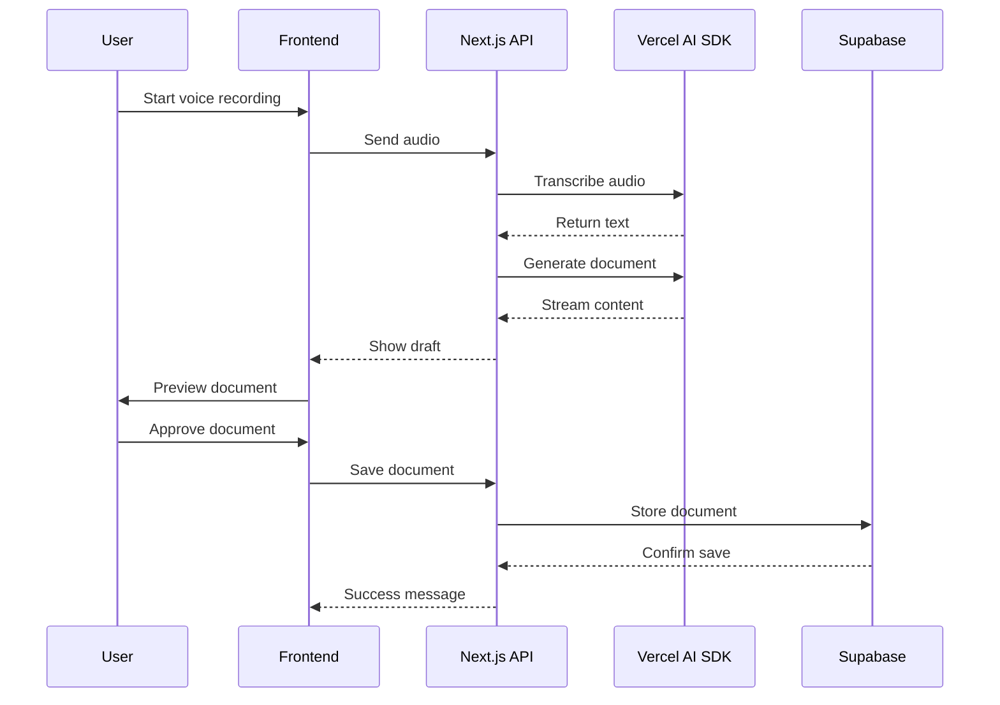

### 7. Performance & Caching Flow

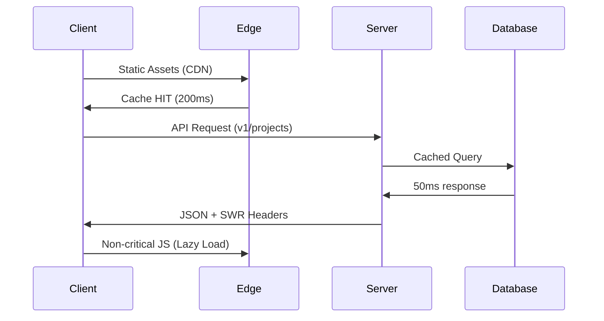

## Implementation Details (project-management-flow.ts)

### 1. Data Models

- User Management ✅
- Project Management ✅
- Task Management ✅
- Document Management ✅
- AI Assistant ✅

### 2. Key Features

- Process Templates
- Document Generation
- Voice Commands
- Search Functionality
- Real-time Updates

### 3. Security

- Row Level Security
- Authentication
- API Validation
- File Access Control

### 4. Performance

- Query Optimization
- Caching Strategy
- Asset Management
- Error Handling

## Integration Points

### 1. Real-time Updates

- Supabase subscriptions for live updates
- Optimistic UI updates
- Background sync

### 2. Error Recovery

- Automatic retry for failed operations
- Offline support
- Data consistency checks

### 3. Performance Optimizations

- Query result caching
- Lazy loading of components
- Asset preloading

### 4. Security Considerations

- JWT token management
- API rate limiting
- Input validation
