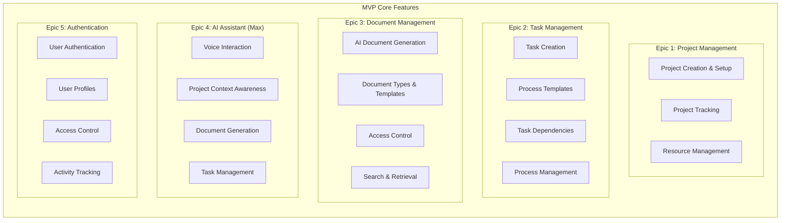
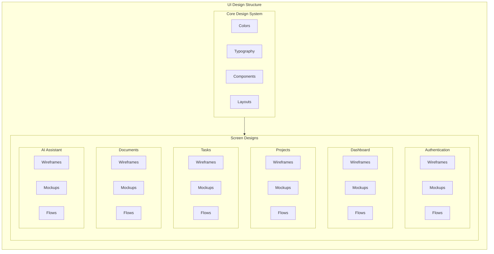
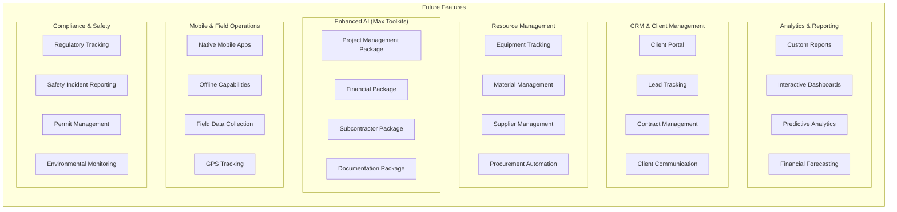
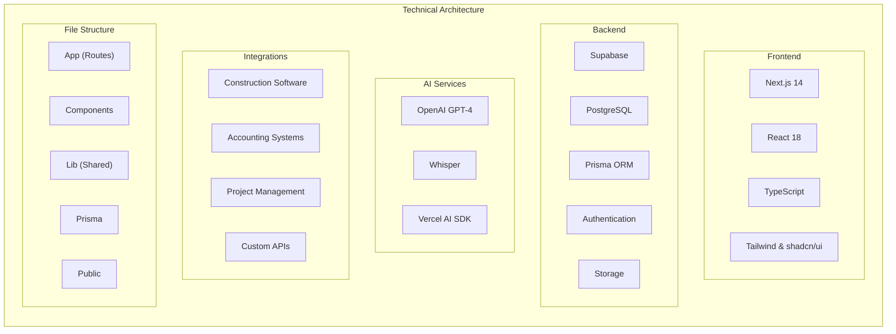
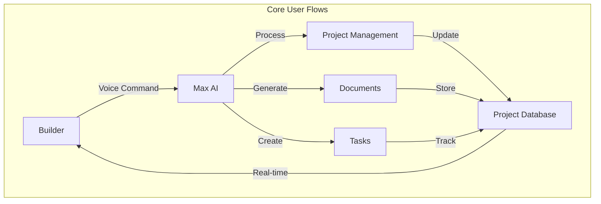
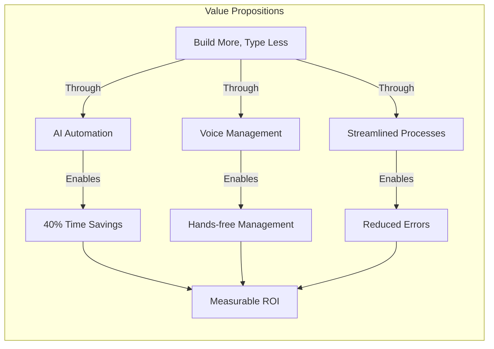
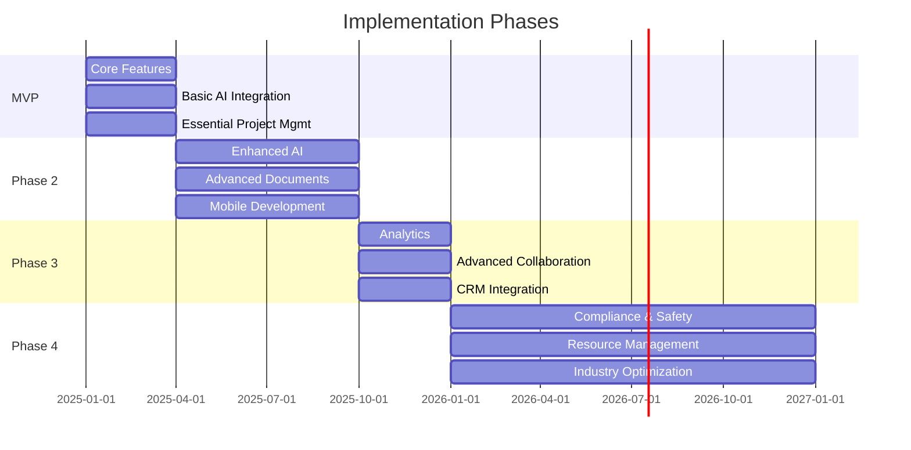

# Constructiv AI System Architecture

## Core MVP Features

## UI Design Architecture

## Future Features & Expansion

## System Integration Architecture

## User Flow Architecture

## Value Delivery Architecture

## Implementation Timeline

